# 🏗️ Instruere AI Prompt Manager - System Architecture

## 📋 Table of Contents

- [🎯 Architectural Overview](#-architectural-overview)
- [🏛️ System Architecture](#️-system-architecture)
- [🔄 Component Interaction Flow](#-component-interaction-flow)
- [🛡️ Security Architecture](#️-security-architecture)
- [📊 Data Architecture](#-data-architecture)
- [🌐 Deployment Architectures](#-deployment-architectures)
- [🔌 API Architecture](#-api-architecture)
- [🌍 Multi-Language Architecture](#-multi-language-architecture)
- [🧩 Prompt Builder Architecture](#-prompt-builder-architecture)
- [⚡ Performance Considerations](#-performance-considerations)
- [🔮 Future Architecture](#-future-architecture)

---

## 🎯 Architectural Overview

The AI Prompt Manager is built on a **unified, modular architecture** that supports both single-user and multi-tenant deployments through a single codebase. The system follows **Domain-Driven Design (DDD)** principles with clear separation of concerns and **microservice-ready components**.

### 🔑 Key Architectural Principles

- **🏗️ Unified Codebase**: Single application supporting multiple deployment modes
- **🔐 Tenant Isolation**: Complete data and security separation
- **📦 Modular Design**: Loosely coupled, independently testable components
- **🔌 API-First**: RESTful API with comprehensive OpenAPI documentation
- **🌐 Internationalization**: Multi-language support at the core
- **⚡ Performance**: Efficient database queries and caching strategies
- **🛡️ Security**: Multi-layer security with JWT and RBAC

---

## 🏛️ System Architecture

```mermaid
graph TB
    %% Client Layer
    subgraph "🌐 Client Layer"
        WEB[🖥️ Web Browser]
        MOB[📱 Mobile Apps]
        API_CLIENT[🔧 API Clients]
        CLI[⌨️ CLI Tools]
    end

    %% Load Balancer
    LB[⚖️ Load Balancer<br/>NGINX/HAProxy]

    %% Application Layer
    subgraph "🚀 Application Layer"
        subgraph "📱 Web Interface"
            GRADIO[🎨 Gradio UI<br/>Multi-Language]
            AUTH_UI[🔐 Auth Interface]
            BUILDER_UI[🧩 Prompt Builder]
        end
        
        subgraph "🔌 API Layer"
            FASTAPI[⚡ FastAPI<br/>REST Endpoints]
            AUTH_API[🔑 Auth API]
            PROMPT_API[📝 Prompt API]
            ADMIN_API[🛡️ Admin API]
        end
    end

    %% Business Logic Layer
    subgraph "🧠 Business Logic Layer"
        subgraph "👤 User Management"
            AUTH_MGR[🔐 Auth Manager]
            USER_MGR[👥 User Manager]
            TENANT_MGR[🏢 Tenant Manager]
            TOKEN_MGR[🔑 Token Manager]
        end
        
        subgraph "📝 Prompt Management"
            PROMPT_MGR[📄 Prompt Manager]
            BUILDER[🧩 Prompt Builder]
            OPTIMIZER[🚀 Multi-Service Optimizer]
            CALCULATOR[🧮 Token Calculator]
        end
        
        subgraph "🌐 Core Services"
            I18N[🌍 Internationalization]
            TRANSLATOR[🔄 Text Translator]
            UI_COMP[🎨 UI Components]
        end
    end

    %% Data Access Layer
    subgraph "💾 Data Access Layer"
        DATA_MGR[🗄️ Data Manager<br/>Tenant-Aware]
        API_TOKEN_MGR[🔐 API Token Manager]
        CONFIG_MGR[⚙️ Config Manager]
    end

    %% External Services
    subgraph "🌍 External Services"
        OPT_SERVICES[🚀 Optimization Services<br/>LangWatch/PromptPerfect<br/>LangSmith/Helicone]
        AI_MODELS[🤖 AI Models<br/>OpenAI/Local]
        TRANSLATE_SVC[🔄 Translation Services<br/>OpenAI/Google/Libre]
        SSO[🔗 SSO/ADFS<br/>Microsoft Azure]
    end

    %% Database Layer
    subgraph "🗄️ Database Layer"
        SQLITE[(📁 SQLite<br/>Development)]
        POSTGRES[(🐘 PostgreSQL<br/>Production)]
    end

    %% Connections
    WEB --> LB
    MOB --> LB
    API_CLIENT --> LB
    CLI --> LB
    
    LB --> GRADIO
    LB --> FASTAPI
    
    GRADIO --> AUTH_MGR
    GRADIO --> PROMPT_MGR
    GRADIO --> I18N
    
    FASTAPI --> AUTH_API
    FASTAPI --> PROMPT_API
    FASTAPI --> ADMIN_API
    
    AUTH_MGR --> DATA_MGR
    PROMPT_MGR --> DATA_MGR
    BUILDER --> PROMPT_MGR
    
    DATA_MGR --> SQLITE
    DATA_MGR --> POSTGRES
    
    OPTIMIZER --> OPT_SERVICES
    CALCULATOR --> AI_MODELS
    TRANSLATOR --> TRANSLATE_SVC
    AUTH_MGR --> SSO

    %% Styling
    classDef clientLayer fill:#e1f5fe,stroke:#0277bd,stroke-width:2px
    classDef appLayer fill:#f3e5f5,stroke:#7b1fa2,stroke-width:2px
    classDef businessLayer fill:#e8f5e8,stroke:#388e3c,stroke-width:2px
    classDef dataLayer fill:#fff3e0,stroke:#f57c00,stroke-width:2px
    classDef externalLayer fill:#fce4ec,stroke:#c2185b,stroke-width:2px
    classDef dbLayer fill:#f1f8e9,stroke:#689f38,stroke-width:2px

    class WEB,MOB,API_CLIENT,CLI clientLayer
    class GRADIO,AUTH_UI,BUILDER_UI,FASTAPI,AUTH_API,PROMPT_API,ADMIN_API appLayer
    class AUTH_MGR,USER_MGR,TENANT_MGR,TOKEN_MGR,PROMPT_MGR,BUILDER,OPTIMIZER,CALCULATOR,I18N,TRANSLATOR,UI_COMP businessLayer
    class DATA_MGR,API_TOKEN_MGR,CONFIG_MGR dataLayer
    class OPT_SERVICES,AI_MODELS,TRANSLATE_SVC,SSO externalLayer
    class SQLITE,POSTGRES dbLayer
```

---

## 🔄 Component Interaction Flow

### 📝 Prompt Management Flow

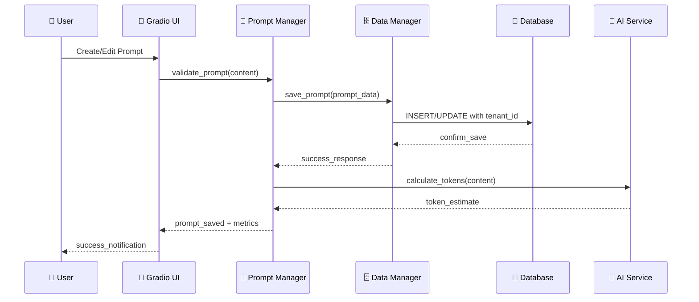

### 🔐 Authentication Flow

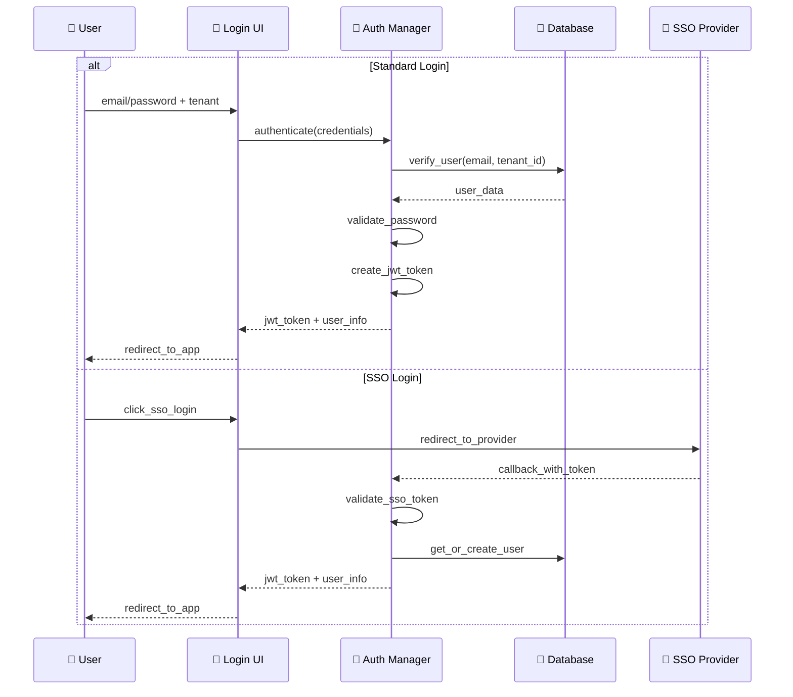

### 🧩 Prompt Builder Flow

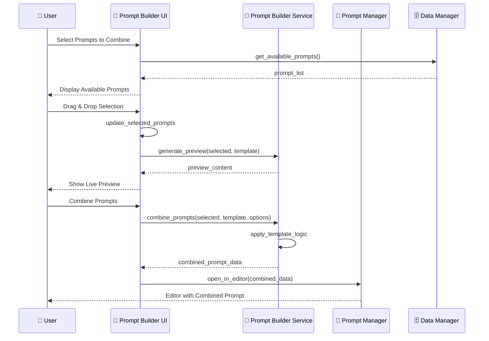

---

## 🛡️ Security Architecture

### 🔐 Multi-Layer Security Model

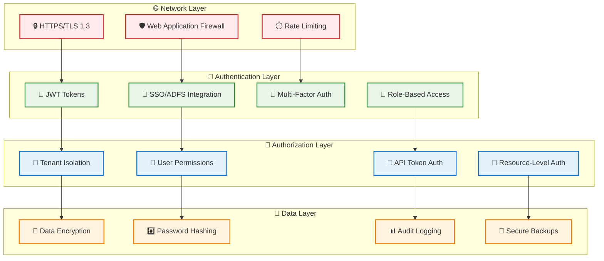

### 🔐 Security Implementation Details

| **Layer** | **Component** | **Implementation** | **Purpose** |
|-----------|---------------|-------------------|-------------|
| **🌐 Network** | HTTPS/TLS | Mandatory SSL encryption | Data in transit protection |
| | Rate Limiting | 100 req/min per API token | DDoS and abuse prevention |
| | CORS | Configured origins only | Cross-origin attack prevention |
| **🔑 Authentication** | JWT Tokens | HS256 signed, 24h expiry | Stateless session management |
| | Password Hashing | PBKDF2 with salt | Secure credential storage |
| | SSO Integration | Microsoft Azure AD | Enterprise authentication |
| **🏢 Authorization** | Tenant Isolation | Row-level security | Complete data separation |
| | RBAC | Admin/User/Readonly roles | Granular permission control |
| | API Tokens | Bearer token authentication | Secure programmatic access |
| **💾 Data** | Database Encryption | AES-256 at rest | Sensitive data protection |
| | Audit Logging | All operations logged | Compliance and monitoring |

---

## 📊 Data Architecture

### 🗄️ Database Schema Design

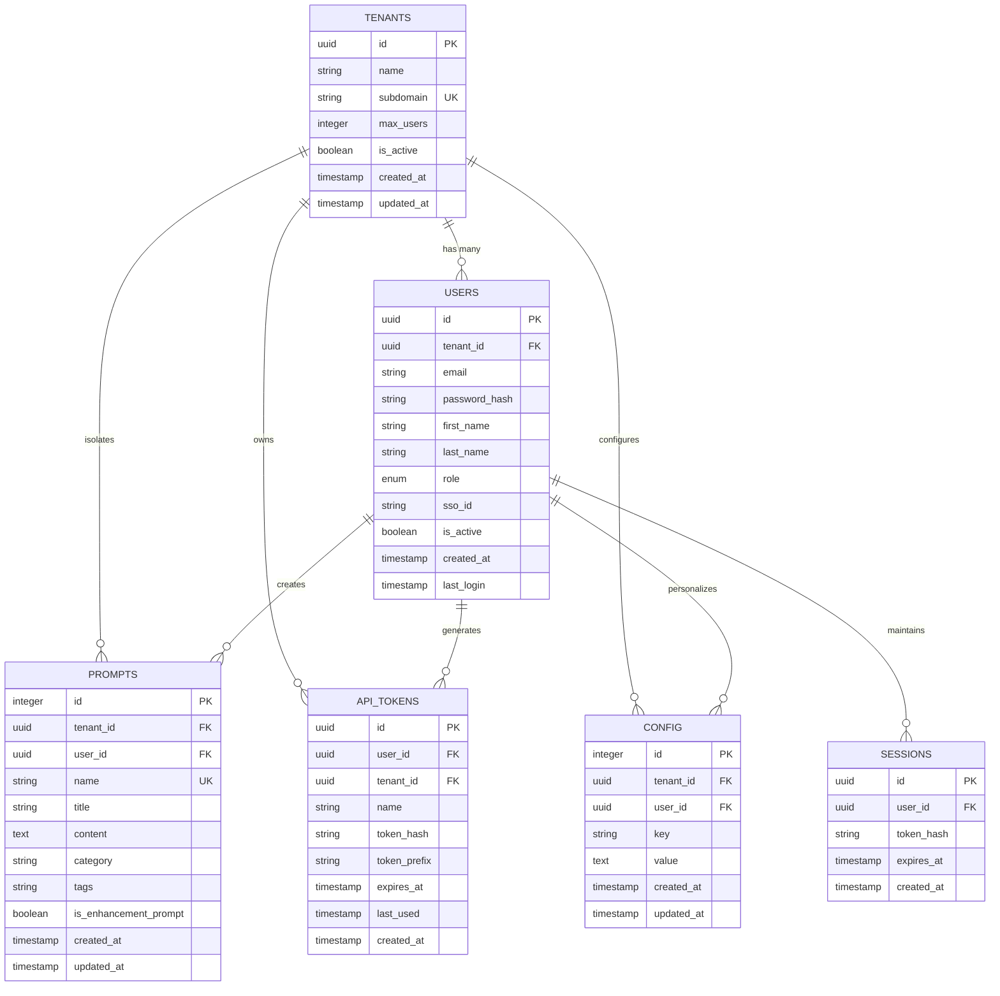

### 📈 Data Flow Architecture

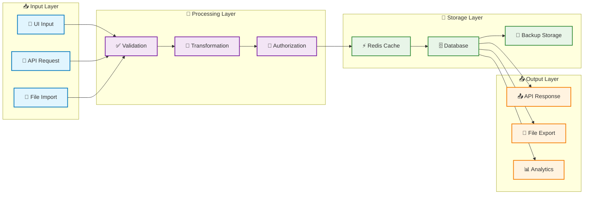

---

## 🌐 Deployment Architectures

### 🚀 Single-Node Deployment

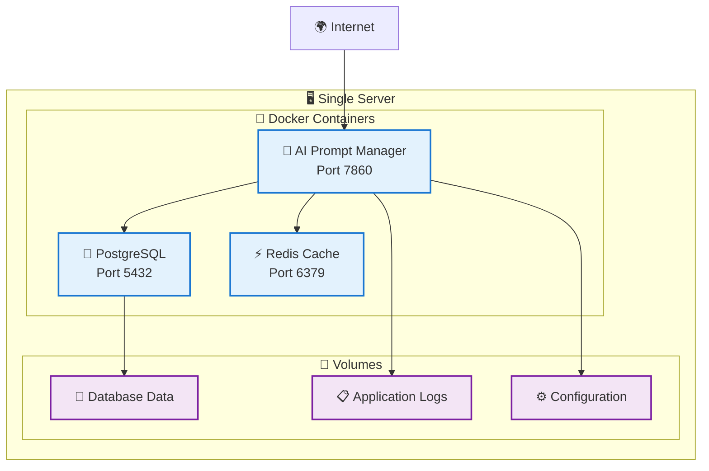

### 🏢 Enterprise Multi-Node Deployment

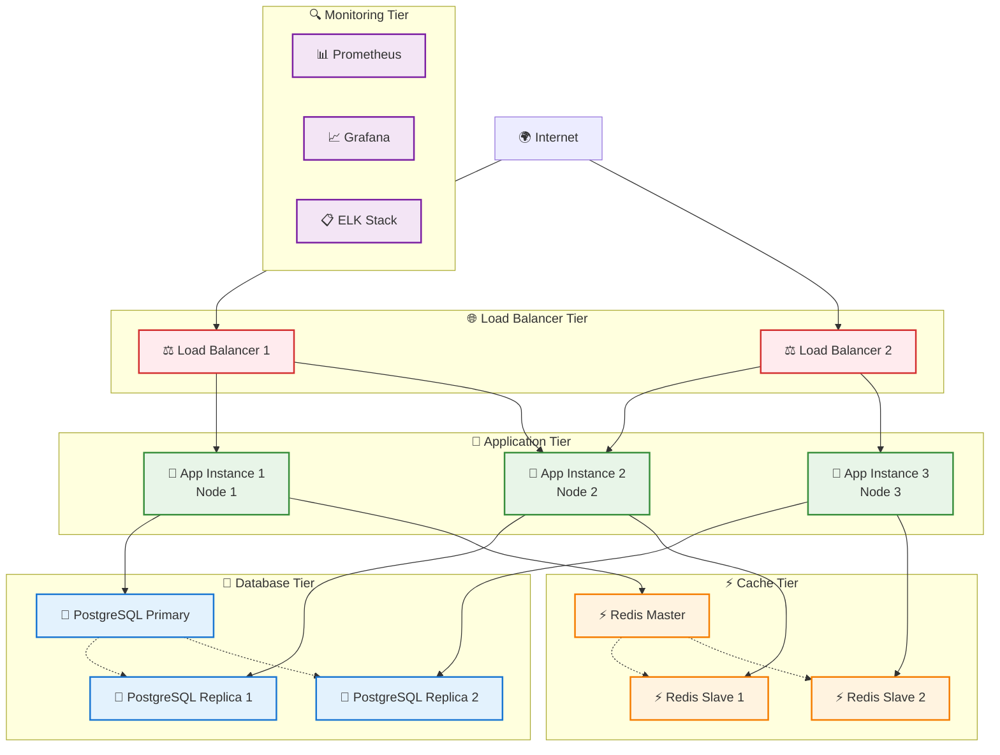

### ☁️ Cloud-Native Kubernetes Deployment

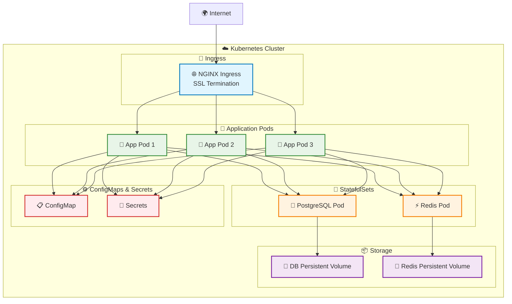

---

## 🔌 API Architecture

### 📊 API Design Pattern

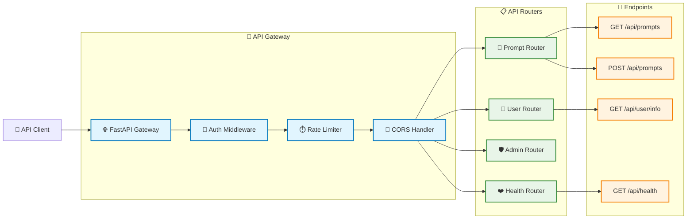

### 🔐 API Security Flow

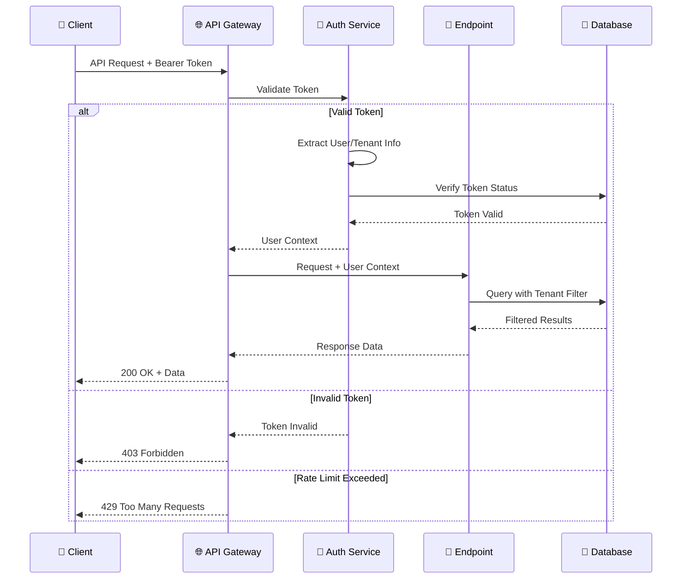

---

## 🌍 Multi-Language Architecture

### 🔄 Internationalization System

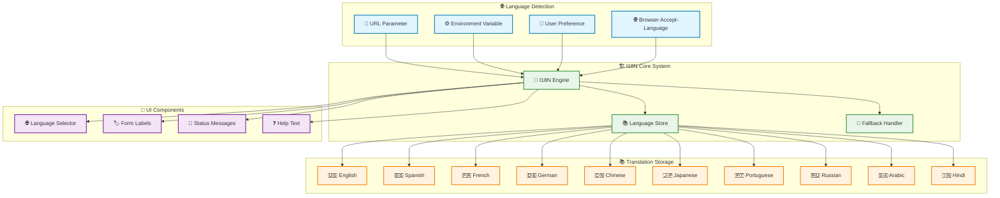

### 🔄 Translation Service Architecture

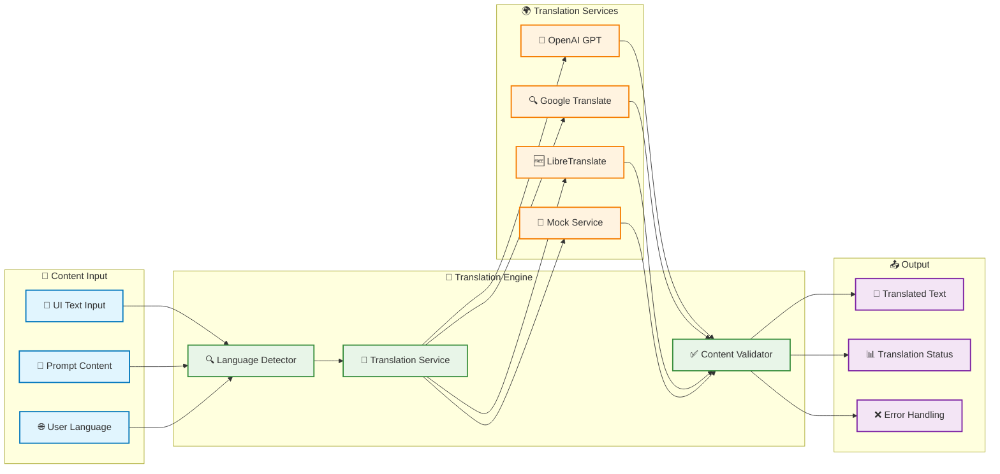

---

## 🧩 Prompt Builder Architecture

### 🔧 Builder Component System

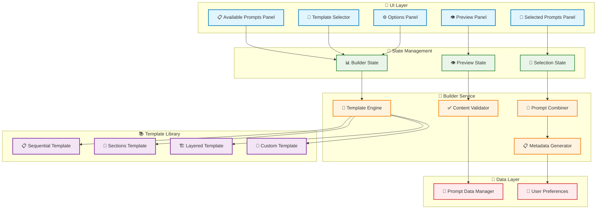

### 🔄 Builder Process Flow

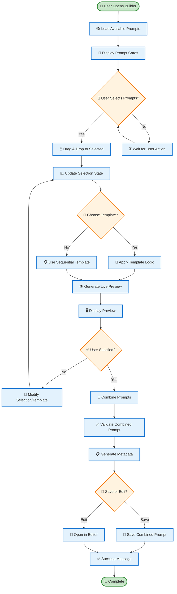

---

## ⚡ Performance Considerations

### 🚀 Performance Optimization Strategy

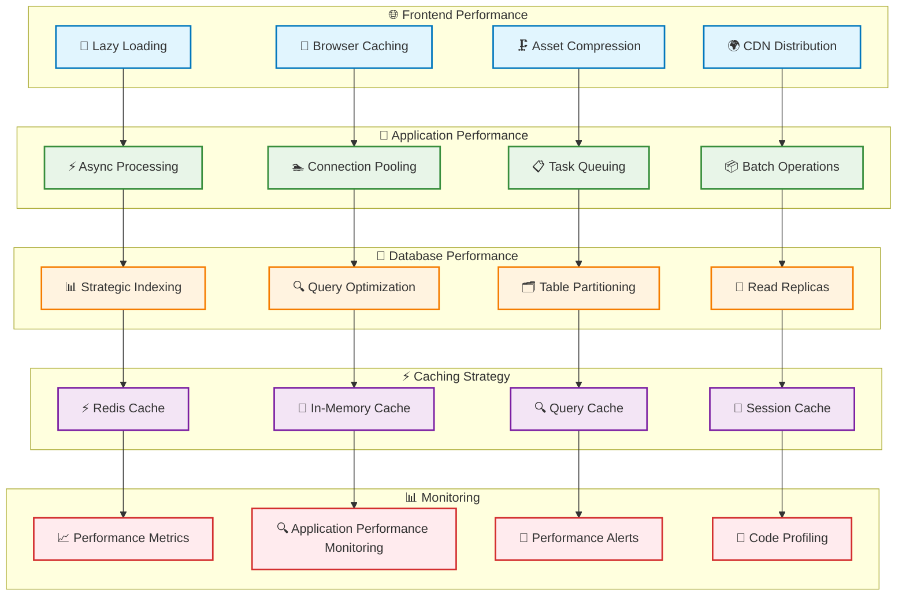

### 📊 Performance Metrics & KPIs

| **Category** | **Metric** | **Target** | **Monitoring** |
|-------------|------------|------------|----------------|
| **🌐 Frontend** | Page Load Time | < 2 seconds | Lighthouse, GTmetrix |
| | First Contentful Paint | < 1.5 seconds | Core Web Vitals |
| | Cumulative Layout Shift | < 0.1 | Web Vitals API |
| **🚀 API** | Response Time | < 200ms (95th percentile) | Prometheus |
| | Throughput | > 1000 req/sec | Load testing |
| | Error Rate | < 0.1% | APM monitoring |
| **💾 Database** | Query Response | < 50ms average | Database monitoring |
| | Connection Pool | < 80% utilization | Connection metrics |
| | Index Efficiency | > 95% index usage | Query analysis |
| **⚡ Cache** | Hit Rate | > 80% | Redis metrics |
| | Memory Usage | < 70% | Memory monitoring |
| | Eviction Rate | < 5% | Cache analytics |

---

## 🔮 Future Architecture

### 🌟 Planned Enhancements

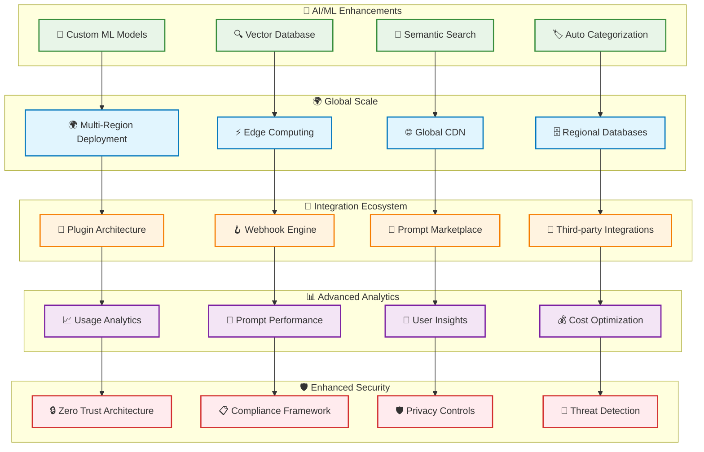

### 🛣️ Architecture Evolution Roadmap

| **Phase** | **Timeline** | **Focus Areas** | **Key Deliverables** |
|-----------|--------------|-----------------|---------------------|
| **Phase 1** | Q1 2025 | Performance & Scale | Redis caching, Database optimization, Load balancing |
| **Phase 2** | Q2 2025 | AI/ML Integration | Vector database, Semantic search, ML-powered categorization |
| **Phase 3** | Q3 2025 | Global Deployment | Multi-region support, Edge computing, Global CDN |
| **Phase 4** | Q4 2025 | Ecosystem & Analytics | Plugin system, Marketplace, Advanced analytics |
| **Phase 5** | Q1 2026 | Security & Compliance | Zero trust, Compliance framework, Privacy controls |

---

## 📚 Architecture Documentation

### 📖 Related Documentation

- **[🚀 Deployment Guide](README.md#🔒-production-deployment)** - Production deployment instructions
- **[🔧 Configuration Guide](README.md#⚙️-configuration)** - Environment and system configuration
- **[🔐 Security Guide](README.md#🏢-multi-tenant-features)** - Security implementation details
- **[📊 API Documentation](README.md#🔑-api-access)** - RESTful API reference
- **[🌐 Multi-Language Guide](README.md#🌐-multi-language-support)** - Internationalization implementation
- **[🧩 Prompt Builder Guide](README.md#🧩-prompt-builder-guide)** - Builder architecture and usage

### 🏗️ Architecture Principles

1. **🔗 Separation of Concerns**: Clear boundaries between layers and components
2. **🔄 Loose Coupling**: Independent, testable, and maintainable modules
3. **📈 Scalability**: Horizontal and vertical scaling capabilities
4. **🛡️ Security by Design**: Multi-layer security architecture
5. **🌐 Multi-tenancy**: Complete isolation and resource sharing
6. **⚡ Performance**: Optimized for speed and efficiency
7. **🔧 Maintainability**: Clean code, documentation, and testing
8. **🚀 Extensibility**: Plugin architecture and API-first design

---

**🏗️ Architecture designed for scale • 🔐 Security by design • 🌐 Global accessibility • 🚀 Future-ready**