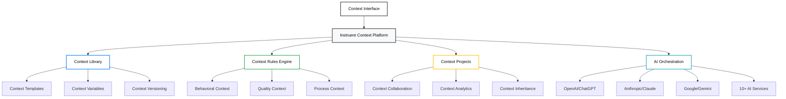
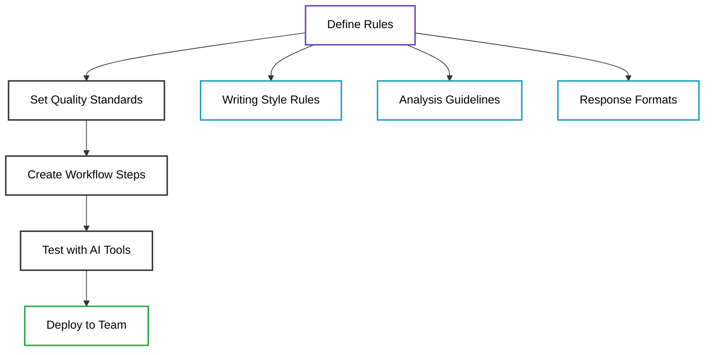
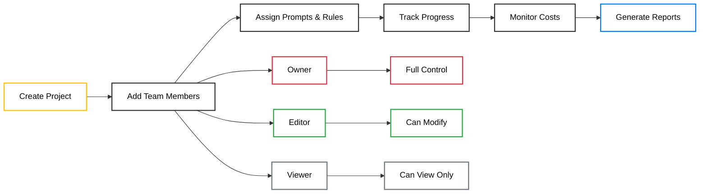
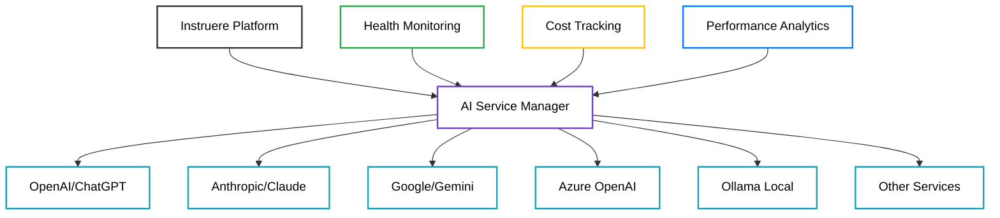
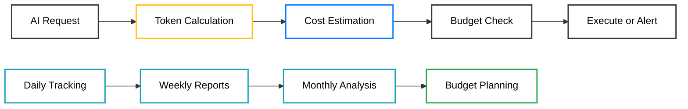
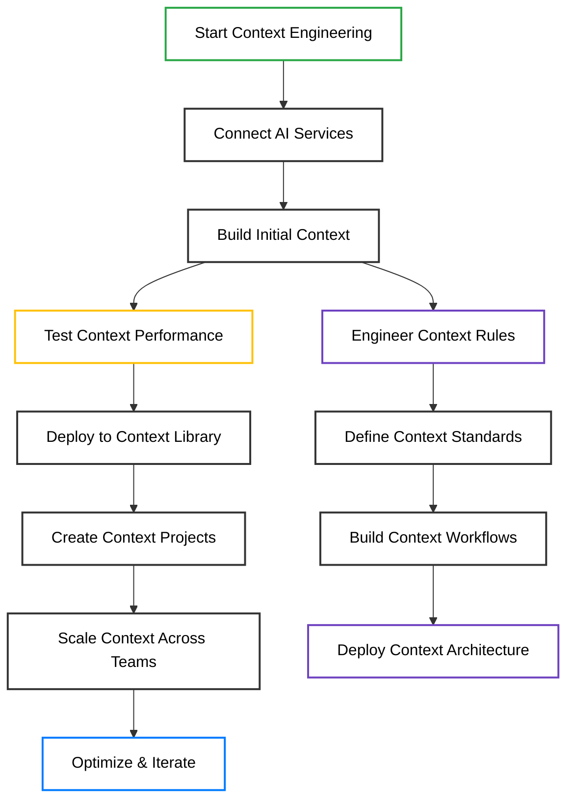

# Instruere: Context Engineering Platform

## Product Overview & Features Guide

---

## 🏛️ **The Name: Instruere**

**Instruere** comes from Latin meaning "to build, to teach, to inform." This perfectly captures our mission: building better AI context, teaching AI systems how to work effectively, and informing AI decisions with clear guidance and structure.

Just like the ancient Romans built lasting infrastructure, Instruere helps you build lasting context infrastructure that makes AI systems more reliable, predictable, and valuable to your organization.

---

## 🎯 **What is Instruere?**

Instruere is the world's first Context Engineering Platform - a comprehensive system for building, managing, and optimizing the context that AI systems need to perform effectively. Think of it as the infrastructure layer that transforms unpredictable AI tools into reliable, consistent business systems.

**Context Engineering Explained:**

Context is everything an AI system needs to understand what you want and how to deliver it. This includes your instructions (prompts), your standards (rules), your business knowledge, and your organizational preferences. Without proper context engineering, AI systems produce random, inconsistent results that vary wildly based on who's using them and how they ask.

### **Core Context Engineering Concepts**

**Context**: All the information, guidance, and constraints that help AI systems understand what you really want and how to deliver it according to your standards.

**Prompts**: The specific instructions you give to AI tools. These are the most visible part of context, but just the beginning.

**Rules**: The behavioral guidelines, quality standards, and operational procedures that ensure AI systems work according to your organization's requirements.

**Context Architecture**: The structured way you organize, version, and deploy context across your organization to ensure consistency and quality.

**Context Inheritance**: How context flows through your organization, from enterprise-wide standards down to specific project requirements.

**Multi-Tenant Context**: Separate context environments for different teams or organizations, ensuring privacy and customization while maintaining shared infrastructure.

---

## 🏗️ **Context Engineering Architecture**

---

## 🧩 **Context Engineering Components**

### **1. Context Library: Your AI Intelligence Repository**

Think of this as your organizational knowledge base that AI systems can understand and apply. Instead of retyping instructions or hoping AI remembers your preferences, you build reusable context that ensures consistent, high-quality results.

**Why Context Management Is Critical:**

The quality of AI results depends entirely on the context you provide. Most organizations struggle with "context engineering" - the discipline of building systematic, reusable context that transforms AI from unpredictable tools into reliable business systems. Without proper context management, every AI interaction starts from zero, wasting time and producing inconsistent results.

**The Hidden Costs of Poor Context Engineering:**
- **Context Reconstruction**: Teams spend 60-80% of their AI time rebuilding context that should be reusable
- **Quality Variance**: AI produces wildly different results for the same business need across team members
- **Context Loss**: When experts leave, their context knowledge disappears from the organization
- **Context Drift**: Great context patterns get forgotten and teams regress to basic, ineffective approaches

**What You Can Do:**

- Build reusable context libraries with rich metadata, categorization, and intelligent search
- Create context templates with variables that adapt to different situations and business needs
- Test and validate context with real AI systems before deploying to production workflows
- Share proven context patterns across teams to scale expertise organization-wide
- Track context performance and effectiveness with detailed analytics and optimization insights
- Version control your context architecture to understand what changes drive better results
- Import/export context in industry-standard formats for seamless tool integration

**Business Value:**
- **3x Faster Context Development**: Teams achieve expert-level results immediately using proven context patterns
- **Consistent AI Performance**: Everyone gets professional-grade AI results regardless of their individual expertise level
- **Context Asset Development**: Your organization's AI context becomes a strategic competitive advantage
- **Accelerated Onboarding**: New team members can immediately leverage expert-level context without extensive training

```mermaid
flowchart LR
    A[Engineer Context] --> B[Add Variables]
    B --> C[Test Context]
    C --> D[Deploy to Library]
    D --> E[Scale Across Teams]
    E --> F[Optimize Performance]
    
    style A fill:#ffffff,stroke:#ffc107,stroke-width:2px,color:#000000
    style B fill:#ffffff,stroke:#333,stroke-width:2px,color:#000000
    style C fill:#ffffff,stroke:#333,stroke-width:2px,color:#000000
    style D fill:#ffffff,stroke:#28a745,stroke-width:2px,color:#000000
    style E fill:#ffffff,stroke:#333,stroke-width:2px,color:#000000
    style F fill:#ffffff,stroke:#007bff,stroke-width:2px,color:#000000
```

**Real-World Example**: Instead of reconstructing context about your company's communication style, brand voice, and formatting preferences every time, you engineer reusable context that automatically provides this background to any AI system.

### **2. Context Rules Engine: Defining AI Behavior**

This is the systematic approach to defining how AI should behave within your organization's context. You create comprehensive behavioral frameworks that ensure AI systems understand and follow your business standards, processes, and requirements consistently.

**Why Context Rules Are Essential:**

AI systems are powerful but lack organizational context by default. Without systematic behavioral frameworks, they operate based on generic training that doesn't understand your business needs, quality standards, or operational requirements. Context rules bridge this gap by encoding your organizational intelligence directly into AI behavior.

**The Context Control Challenge:**

As AI becomes more autonomous, the need for context control becomes critical. AI agents making independent decisions without proper context can damage brand reputation, violate compliance requirements, or produce work that doesn't meet business standards. Context rules provide the guardrails that enable AI autonomy while maintaining organizational control.

**Key Concepts:**

- **AI Agents**: AI tools that work somewhat independently, making decisions based on your rules
- **Behavioral Guidelines**: Specific rules about how AI should respond in different situations
- **Quality Standards**: Clear definitions of what makes a good result in your context
- **Workflow Steps**: Detailed procedures for complex multi-step tasks
- **Guardrails**: Boundaries that prevent AI from going off-track or producing inappropriate content

**The Cost of Inconsistent AI:**
- **Brand Risk**: AI that doesn't follow brand guidelines can damage reputation
- **Quality Variations**: Results range from excellent to embarrassing with no predictability
- **Compliance Issues**: AI that doesn't follow regulatory or company policies creates legal risk
- **Productivity Loss**: Teams waste time fixing AI outputs that don't meet standards

**What You Can Do:**

- Create comprehensive style guides that AI follows automatically
- Build step-by-step procedures for complex business processes
- Set quality checkpoints and validation rules for AI outputs
- Define ethical boundaries and compliance requirements
- Create specialized rules for different departments or use cases
- Export rules to integrate with popular AI tools like Claude, ChatGPT, and GitHub Copilot
- Version control your rules to track what guidance works best

**Enterprise Value:**
- **Risk Mitigation**: Prevent AI from producing content that violates policies or damages brand
- **Scalable Expertise**: Codify your best practices so they're applied consistently
- **Compliance Assurance**: Build regulatory requirements directly into AI behavior
- **Quality Guarantee**: Ensure professional standards regardless of who's using the AI

### **3. Project Management: Organizing AI Work**

Projects help you organize related AI work into manageable groups. Like having different folders for different types of work, but with powerful collaboration and tracking features.

**Why Projects Are Critical:**

As teams adopt AI more widely, the chaos grows exponentially. Without project organization, you end up with scattered prompts, duplicate work, unclear ownership, and no visibility into costs or results. Projects solve the collaboration nightmare that kills AI adoption in larger organizations.

**The Collaboration Challenge:**

Most AI tools are designed for individual use. But real business value comes from teams working together. Projects bridge this gap by providing structure, accountability, and shared resources that make team AI work actually productive.

**Project Types Explained:**

**General Projects**: Flexible organization for research, exploration, and mixed workflows where you need to group related AI work without rigid structure.

**Sequenced Projects**: Multi-step processes where outputs from one stage become inputs for the next. Perfect for content pipelines, analysis workflows, or any process with dependencies.

**LLM Comparison Projects**: Systematic testing across multiple AI models to find the best performance for specific tasks. Essential for optimizing both quality and costs.

**Developer Projects**: Specialized workflows for code generation, technical documentation, and software development processes with version control integration.

**The Hidden Costs of Unorganized AI Work:**
- **Duplicate Efforts**: Teams unknowingly work on the same problems multiple times
- **Cost Blindness**: No visibility into AI spending leads to budget surprises
- **Knowledge Silos**: Great work gets trapped in individual accounts
- **Quality Inconsistency**: No shared standards or review processes
- **Accountability Gaps**: Unclear ownership when projects span multiple people

**What You Can Do:**

- Create structured workspaces that organize all related AI assets
- Set up automatic cost tracking and budget alerts for realistic planning
- Define clear roles and permissions to manage team access appropriately
- Track progress with milestone tracking and deliverable management
- Transfer ownership seamlessly when team members change roles
- Generate detailed reports on project performance and ROI
- Integrate with existing business tools and workflows
- Archive completed projects while preserving lessons learned

**Business Impact:**
- **Team Productivity**: Organized collaboration reduces AI work time by 40-60%
- **Cost Control**: Real-time budget tracking prevents runaway AI expenses
- **Knowledge Retention**: Project structure preserves institutional learning
- **Quality Assurance**: Shared standards and review processes improve outcomes
- **Scalability**: Proven project templates can be replicated across teams

### **4. AI Service Management: Connecting to AI Tools**

This feature helps you connect to and manage multiple AI services from one place. Instead of jumping between different AI websites, you control everything from Instruere.

**Why Multi-Service Management Matters:**

The AI landscape is fragmented and rapidly evolving. Different AI models excel at different tasks, and relying on just one service leaves performance and money on the table. But managing multiple AI accounts, APIs, and billing systems creates operational chaos. Instruere solves this by providing a unified control center.

**The Multi-Vendor Reality:**
- **No Single Best AI**: Each model has strengths and weaknesses for different tasks
- **Pricing Variations**: Costs vary dramatically between services and change frequently
- **Availability Issues**: Services go down, rate limits hit, and models get updated
- **Compliance Requirements**: Different industries need different AI providers

**Strategic Advantages of Multi-Service Approach:**
- **Risk Mitigation**: Avoid vendor lock-in and service outages
- **Cost Optimization**: Automatically route work to the most cost-effective service
- **Performance Maximization**: Use the best AI model for each specific task
- **Future-Proofing**: Easily adopt new AI services as they emerge

**Supported AI Services:**

**Enterprise-Grade Services:**
- **OpenAI** (GPT-4, GPT-3.5) - Industry standard for general intelligence
- **Azure OpenAI** - Enterprise version with enhanced security and compliance
- **Anthropic** (Claude 3 Opus, Sonnet, Haiku) - Superior reasoning and safety
- **Google** (Gemini Pro, Ultra) - Strong at analysis and multimodal tasks

**Specialized & Local Options:**
- **Ollama** - Run AI models locally for maximum privacy
- **LM Studio** - Local deployment with user-friendly interface
- **Hugging Face** - Access to thousands of open-source models
- **Cohere** - Specialized for enterprise text generation
- **Together AI** - High-performance model hosting platform
- **Llama CPP** - Efficient deployment of Meta's Llama models

**What You Can Do:**

**Centralized Management:**
- Connect multiple AI services using your own API keys and accounts
- Monitor service health, availability, and performance in real-time
- Set up automatic failover when services are unavailable
- Manage API rate limits and usage quotas across all services

**Intelligent Routing:**
- Configure which AI service to use for different types of tasks
- Set up cost-based routing to minimize expenses automatically
- Create performance-based routing for quality optimization
- Implement fallback chains when primary services are unavailable

**Cost Optimization:**
- Track spending across all AI services in a unified dashboard
- Set budget alerts and automatic cost controls
- Generate detailed cost reports by project, user, or service
- Get recommendations for cost-effective service selection

**Enterprise Features:**
- Centralized billing and cost allocation across teams
- Security and compliance monitoring for all AI interactions
- Audit trails for regulatory requirements
- Integration with corporate SSO and access management

**Business Value:**
- **Cost Savings**: Teams typically reduce AI costs by 30-50% through optimized routing
- **Risk Reduction**: Multi-vendor strategy eliminates single points of failure
- **Performance Gains**: Using the right AI for each task improves results significantly
- **Operational Efficiency**: Unified management reduces administrative overhead

### **5. Multi-Language Support: Global Accessibility**

Instruere works in 10 different languages, making it accessible to teams around the world.

**Why Global Language Support Is Essential:**

AI adoption is happening worldwide, but most AI tools are built with English-first assumptions. This creates barriers for international teams and limits the global potential of AI technology. True enterprise AI platforms must be genuinely international, not just English with basic translations.

**The Global AI Challenge:**

As organizations expand internationally, they need AI tools that work seamlessly across cultures and languages. Half-hearted localization creates frustration, reduces adoption, and limits the ROI of AI investments. Instruere's deep multi-language support removes these barriers.

**Beyond Simple Translation:**

Most software just translates button labels. Instruere provides comprehensive language support that includes cultural considerations, local business practices, and region-specific AI optimization. This is true internationalization, not just superficial localization.

**Supported Languages:**

**Western Languages:**
- **English** (US/UK variants) - Primary development language
- **Spanish** - Growing rapidly in business AI adoption
- **German** - Critical for European enterprise markets
- **Portuguese** - Essential for Brazilian and Portuguese markets
- **French** - Important for European and African markets
- **Italian** - Key European business language

**Global Languages:**
- **Russian** - Significant Eastern European and Central Asian presence
- **Japanese** - Major technology and business market
- **Chinese** (Simplified) - Largest global AI market by volume
- **Arabic** - Growing Middle Eastern and North African markets

**What You Can Do:**

**Interface Localization:**
- Switch the entire interface to your preferred language instantly
- Maintain language preferences across sessions and devices
- Support right-to-left languages like Arabic with proper layout
- Include cultural formatting for dates, numbers, and currency

**Content Management:**
- Create prompts and rules in any supported language
- Use automatic translation services to convert between languages
- Maintain multilingual versions of the same content with version control
- Search and filter content across languages with intelligent matching

**Team Collaboration:**
- Allow team members to work in their preferred languages
- Share content across language barriers with built-in translation
- Create multilingual project templates and workflows
- Generate reports in the recipient's preferred language

**AI Workflow Optimization:**
- Optimize prompts for different languages to improve AI performance
- Handle cultural context and regional business practices automatically
- Route requests to AI services that perform best in specific languages
- Maintain consistent quality standards across all supported languages

**Enterprise Benefits:**
- **Global Deployment**: Roll out AI tools to international offices without language barriers
- **Inclusive Adoption**: Ensure all team members can participate regardless of English proficiency
- **Cultural Sensitivity**: Respect local business practices and communication styles
- **Regulatory Compliance**: Meet local language requirements for documentation and audit trails
- **Market Expansion**: Enable AI-powered content creation for global markets

**Business Impact:**
- **Faster International Rollouts**: Deploy to global teams 60% faster than English-only solutions
- **Higher Adoption Rates**: Non-English speakers are 3x more likely to adopt tools in their native language
- **Reduced Training Costs**: Eliminate language training barriers for AI tool adoption
- **Global Consistency**: Maintain quality standards across all international operations

### **6. Cost Management: Understanding AI Expenses**

AI services charge based on how much you use them. Instruere helps you understand and control these costs.

**Why Cost Management Is Critical:**

AI costs can spiral out of control quickly. Unlike traditional software with predictable licensing, AI services charge by usage, creating variable costs that can surprise organizations. Without proper monitoring and controls, teams can unknowingly rack up thousands in AI expenses, leading to budget overruns and executive backlash against AI initiatives.

**The Hidden AI Cost Crisis:**

Most organizations discover their AI spending problem too late. Teams start with small experiments, costs seem minimal, then suddenly monthly bills jump from hundreds to thousands of dollars. By the time finance notices, the damage is done and AI projects get shut down or severely restricted.

**Common Cost Management Failures:**
- **No Visibility**: Teams don't know what they're spending until the bill arrives
- **Inefficient Usage**: Using expensive models for simple tasks that cheaper ones could handle
- **Redundant Work**: Multiple team members solving the same problems independently
- **Runaway Automation**: Automated processes consuming expensive AI without oversight
- **Poor Model Selection**: Always using the most expensive "best" model regardless of task complexity

**Key Concepts:**

- **Tokens**: The fundamental units AI services use to measure usage (roughly 1 token = 4 characters of text)
- **Input vs Output Costs**: Most services charge differently for text you send vs text they generate
- **Model Pricing Tiers**: More capable models cost significantly more per token
- **Rate Limits**: How many requests you can make affects both cost and performance
- **Batch vs Real-time**: Different pricing models for different usage patterns

**The True Cost Structure:**
Understanding AI costs requires more than just looking at per-token pricing. You need to consider context windows, model capabilities, processing speed, and opportunity costs of choosing different services.

**What You Can Do:**

**Real-Time Cost Control:**
- See exact cost estimates before running any AI task
- Set hard budget limits that prevent accidental overspending
- Get instant alerts when approaching cost thresholds
- Track spending in real-time across all projects and team members

**Intelligent Cost Optimization:**
- Automatically route simple tasks to cheaper AI models
- Identify patterns of inefficient usage and suggest improvements
- Compare costs across different AI services for the same task
- Optimize prompt length and structure to reduce token consumption

**Comprehensive Reporting:**
- Generate detailed cost reports by user, project, time period, or AI service
- Track cost trends and identify spending patterns
- Calculate ROI by comparing AI costs to productivity gains
- Create budget forecasts based on historical usage patterns

**Team Cost Management:**
- Set individual or team budgets with automatic enforcement
- Allocate costs to specific projects or cost centers
- Track which team members or departments are driving costs
- Implement approval workflows for high-cost AI operations

**Enterprise Financial Controls:**
- Integration with corporate billing and expense management systems
- Automated cost allocation for accurate project accounting
- Compliance reporting for audit and regulatory requirements
- Chargeback capabilities for departmental cost allocation

**Strategic Value:**
- **Budget Predictability**: Transform variable AI costs into manageable, predictable expenses
- **Resource Optimization**: Ensure AI spending delivers maximum business value
- **Risk Mitigation**: Prevent cost surprises that could derail AI initiatives
- **Performance Insights**: Understand which AI investments generate the best returns

**Typical Cost Savings:**
Organizations using Instruere's cost management typically see:
- **40-60% reduction** in AI expenses through intelligent routing
- **80% fewer** budget surprises and overruns
- **3x better** cost-to-value ratio through optimization
- **50% less** time spent on AI expense management

### **7. Team Collaboration: Working Together**

Instruere is designed for teams to work together effectively with AI tools.

**Why Collaboration Is the AI Multiplier:**

Individual AI use has limits. Real transformation happens when teams collaborate effectively with AI. But most AI tools are built for solo work, creating silos that limit organizational learning and scaling. Instruere bridges this gap by making AI collaboration natural and productive.

**The Team AI Challenge:**

As AI adoption grows, organizations face a collaboration crisis. Great prompts get trapped in individual accounts. Teams duplicate work unknowingly. Quality varies wildly between team members. Knowledge walks out the door when people leave. Without proper collaboration tools, AI becomes a productivity barrier instead of a multiplier.

**Beyond Individual AI Use:**

Moving from individual AI experiments to team AI productivity requires more than just sharing access. You need structured collaboration, clear ownership, knowledge transfer, and quality assurance. Instruere provides the infrastructure for truly collaborative AI work.

**Collaboration Features:**

**Structured Access Control:**
- **Role-Based Permissions**: Carefully designed permission levels that balance access with security
- **Project-Level Control**: Different access levels for different projects based on sensitivity
- **Dynamic Permissions**: Ability to grant temporary access for specific tasks or time periods
- **Inheritance Rules**: Permissions that flow logically through organizational hierarchies

**Knowledge Sharing:**
- **Asset Libraries**: Shared repositories of prompts, rules, and templates accessible to appropriate team members
- **Best Practice Capture**: Systems for identifying and promoting successful AI approaches
- **Cross-Team Learning**: Mechanisms for sharing insights between different departments or projects
- **Institutional Memory**: Preservation of AI knowledge that survives personnel changes

**Quality Assurance:**
- **Peer Review**: Workflows for reviewing and approving AI content before it's used widely
- **Version Control**: Complete history of changes with ability to roll back to previous versions
- **Quality Standards**: Enforcement of organizational quality standards across all AI work
- **Testing Protocols**: Systematic approaches to validating AI outputs before deployment

**Activity Transparency:**
- **Real-Time Activity Feeds**: See what team members are working on without being intrusive
- **Progress Tracking**: Monitor project advancement and identify bottlenecks
- **Contribution Recognition**: Track and acknowledge individual and team contributions
- **Audit Trails**: Complete records of who did what for accountability and compliance

**User Roles Explained:**

**Project-Level Roles:**
- **Owner**: Complete control over project resources, team membership, and strategic direction
- **Editor**: Can modify content, create new assets, and contribute actively to project goals
- **Reviewer**: Can approve changes and provide feedback but cannot make direct modifications
- **Viewer**: Read-only access to project resources for awareness and learning
- **Contributor**: Limited editing rights for specific assets or time periods

**Organization-Level Roles:**
- **Admin**: System-wide management including user provisioning, security settings, and compliance
- **Manager**: Departmental oversight with ability to create projects and manage team access
- **User**: Standard team member with project-based permissions
- **Guest**: Limited access for external collaborators or temporary team members

**Advanced Collaboration Features:**

**Workflow Integration:**
- Connect with existing business tools like Slack, Microsoft Teams, or project management platforms
- Automated notifications and updates that fit into existing communication patterns
- Integration with corporate directory services for seamless user management
- API access for custom workflow development

**Knowledge Management:**
- Automated tagging and categorization of shared resources
- Search functionality that spans all accessible content with intelligent ranking
- Recommendation engines that suggest relevant content based on current work
- Analytics that identify the most valuable shared resources

**Quality Control:**
- Automated quality checks based on organizational standards
- Peer review workflows with customizable approval processes
- Performance tracking for shared resources with usage analytics
- Continuous improvement processes based on collective feedback

**Organizational Benefits:**
- **Accelerated Learning**: New team members can immediately leverage organizational AI expertise
- **Reduced Duplication**: Teams avoid recreating work that others have already perfected
- **Quality Consistency**: Shared standards ensure professional results regardless of individual skill level
- **Risk Management**: Proper oversight and controls prevent AI misuse or quality failures
- **Scalable Growth**: Collaboration infrastructure that grows with the organization

**Productivity Impact:**
Organizations with effective AI collaboration typically see:
- **5x faster** onboarding for new team members using AI tools
- **70% reduction** in duplicate AI work across teams
- **3x improvement** in AI output quality through shared best practices
- **80% better** retention of AI knowledge when team members change roles

### **8. Security & Privacy: Keeping Your Work Safe**

**Why Security Is Non-Negotiable for AI:**

AI systems handle your most sensitive business information - strategic plans, customer data, proprietary processes, and competitive intelligence. A security breach in your AI workflow platform could expose everything. Yet most AI tools prioritize features over security, leaving organizations vulnerable to catastrophic data breaches and compliance violations.

**The AI Security Crisis:**

Traditional security thinking doesn't apply to AI workflows. Your prompts contain business logic. Your rules reveal strategic thinking. Your project discussions include confidential information. Without enterprise-grade security, AI tools become a massive liability that could cost your organization millions in breaches, fines, and competitive damage.

**Beyond Basic Security:**

Most platforms offer basic password protection and call it secure. Enterprise AI requires defense-in-depth: multiple layers of protection that address the unique risks of AI workflows. Instruere is built from the ground up with enterprise security requirements that protect your most valuable information.

**Security Features:**

**Infrastructure Security:**
- **Multi-Tenant Architecture**: Complete isolation between organizations with no shared resources or data paths
- **Encrypted Data Storage**: All data encrypted at rest using industry-standard AES-256 encryption
- **Encrypted Transmission**: All communications protected with TLS 1.3 encryption
- **Secure Hosting**: Infrastructure hosted on SOC 2 compliant cloud platforms with 24/7 monitoring

**Access Control:**
- **Multi-Factor Authentication**: Required for all user accounts with support for TOTP and SMS
- **Single Sign-On Integration**: Support for SAML, OAuth, and corporate identity providers
- **Role-Based Access Control**: Granular permissions that enforce least-privilege access
- **Session Management**: Automatic timeout and secure session handling with configurable policies

**Data Protection:**
- **Data Residency**: Control where your data is stored to meet regulatory requirements
- **Backup Security**: Encrypted backups with geographic distribution and retention controls
- **Secure APIs**: All API endpoints protected with token-based authentication and rate limiting
- **Input Sanitization**: Protection against injection attacks and malicious input

**Audit and Compliance:**
- **Complete Audit Trails**: Every action logged with user, timestamp, and detailed activity information
- **Compliance Reporting**: Pre-built reports for SOC 2, GDPR, HIPAA, and other regulatory frameworks
- **Data Retention**: Configurable retention policies that meet legal and business requirements
- **Export Controls**: Secure data export with encryption and access controls

**Privacy Protection:**

**Data Sovereignty:**
- **Your Data Stays Yours**: No data sharing, no training on your content, no third-party access
- **Explicit Consent**: Clear controls over what data is used for what purposes
- **Deletion Rights**: Complete data deletion capabilities that meet GDPR and similar regulations
- **Data Portability**: Export your data in standard formats without vendor lock-in

**Organizational Privacy:**
- **Tenant Isolation**: Complete separation between different organizations with no data leakage
- **Private Deployment**: Option for dedicated instances that share no infrastructure
- **On-Premises Deployment**: Full control over your infrastructure and data location
- **Air-Gapped Operation**: Support for disconnected environments with high security requirements

**AI Privacy:**
- **Model Privacy**: Your prompts and data never used to train external AI models
- **Processing Isolation**: AI processing happens in isolated environments with no cross-contamination
- **Metadata Protection**: Even usage patterns and metadata kept private and secure
- **Third-Party Controls**: Strict controls over any third-party AI service integration

**Regulatory Compliance:**

**Global Privacy Standards:**
- **GDPR Compliance**: Full compliance with European data protection regulations
- **CCPA Compliance**: California Consumer Privacy Act requirements met
- **PIPEDA Compliance**: Canadian privacy law compliance for international operations
- **Industry Standards**: SOC 2 Type II, ISO 27001, and other security certifications

**Sector-Specific Requirements:**
- **HIPAA**: Healthcare data protection for medical organizations
- **FERPA**: Educational record protection for academic institutions
- **Financial Services**: Compliance with banking and financial industry regulations
- **Government**: FedRAMP and other government security standards

**Enterprise Security Benefits:**
- **Risk Mitigation**: Comprehensive protection against data breaches and security incidents
- **Compliance Assurance**: Meet regulatory requirements without expensive custom security implementation
- **Competitive Protection**: Keep proprietary AI strategies and processes secure from competitors
- **Executive Confidence**: Security standards that satisfy board-level oversight and due diligence
- **Insurance Benefits**: Robust security posture that may reduce cyber insurance premiums

**Security ROI:**
Organizations with proper AI security see:
- **90% reduction** in security incidents related to AI tool usage
- **70% faster** compliance audits with automated reporting and documentation
- **$2.5M average** savings from prevented data breaches (based on IBM Cost of Data Breach Report)
- **60% reduction** in security overhead through built-in compliance features

---

## 🚀 **Context Engineering Journey**

---

## 💡 **Real-World Use Cases**

### **For Marketing Teams**

- Create templates for social media posts
- Set brand voice rules for AI content
- Track content creation costs
- Collaborate on campaign messaging

### **For Development Teams**

- Store code generation prompts
- Create documentation standards
- Compare different AI coding assistants
- Manage technical project workflows

### **For Customer Support**

- Build response templates for common issues
- Set quality standards for AI-assisted responses
- Track resolution costs and efficiency
- Share best practices across support teams

### **For Content Creators**

- Organize writing prompts by topic
- Set style guidelines for different content types
- Track content generation costs
- Collaborate with editors and reviewers

### **For Research Teams**

- Create analysis templates
- Set research methodology standards
- Compare AI models for different research tasks
- Manage multi-phase research projects

---

## 🏢 **Deployment Options**

### **Personal Use (Single-User Mode)**

- No login required
- Perfect for individual professionals
- Local data storage
- Full feature access

### **Team Use (Multi-Tenant Mode)**

- User accounts and permissions
- Team collaboration features
- Shared libraries and projects
- Administrative controls

### **Enterprise Deployment**

- Custom security configurations
- Advanced audit trails
- Integration with company systems
- Professional support options

---

## 📊 **Why Choose Instruere?**

### **Compared to Managing AI Work Manually:**

- ❌ **Manual**: Lose track of good prompts, repeat work, no cost visibility
- ✅ **Instruere**: Organized library, reusable templates, clear cost tracking

### **Compared to Basic AI Tools:**

- ❌ **Basic Tools**: Limited collaboration, no cost control, single AI service
- ✅ **Instruere**: Full team features, budget management, multiple AI services

### **Compared to Building Your Own System:**

- ❌ **Build Your Own**: Months of development, ongoing maintenance, security concerns
- ✅ **Instruere**: Ready to use, professionally maintained, enterprise security

---

## 🔮 **The Future of Context Engineering**

As AI becomes more autonomous and central to business operations, the quality and consistency of context becomes the determining factor in AI success or failure. Organizations that master context engineering will have AI systems that work reliably as business assets, while those that don't will struggle with unpredictable, inconsistent AI that creates more problems than it solves.

Instruere positions your organization for this context-driven AI future by providing:

1. **Context Infrastructure**: Scalable systems for building, managing, and deploying organizational context
2. **Context Evolution**: Architecture that adapts as AI capabilities advance and context requirements grow
3. **Enterprise Context**: Security and governance that meets enterprise requirements for context management
4. **Global Context**: Support for multi-language, multi-cultural context engineering at scale

---

## 🎬 **Ready to Begin Context Engineering?**

Instruere transforms how organizations approach AI - from unpredictable, inconsistent results to systematic, reliable AI systems that deliver consistent business value. Whether you're a context engineering pioneer looking to establish systematic AI practices or an enterprise needing scalable AI infrastructure, Instruere provides the foundation for context-driven AI success.

**Installation Options:**

- **Quick Start**: `pip install promptman` then `python -m promptman`
- **Docker**: Full containerized deployment with enterprise context features
- **Enterprise**: Custom deployment with dedicated context engineering support

Start building systematic AI context today with Instruere - where ancient principles of instruction meet modern context engineering innovation.
