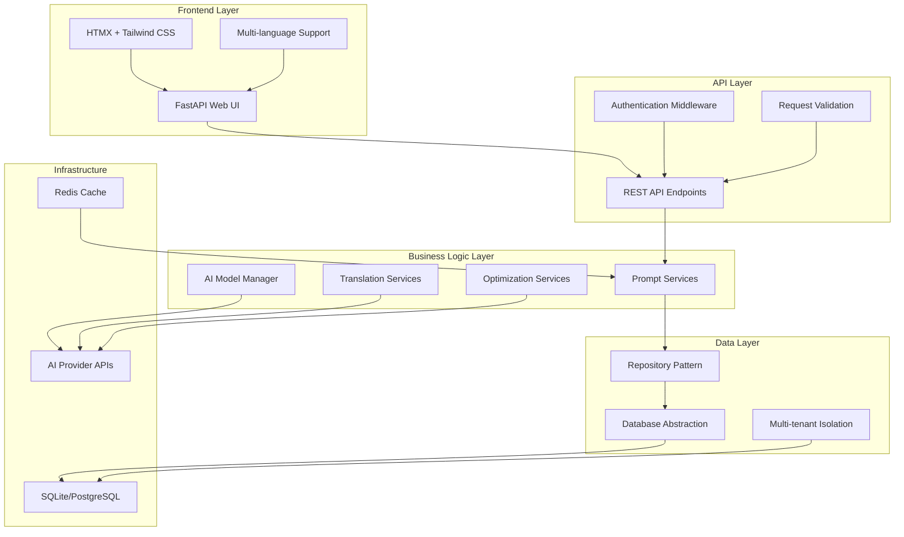

# 🛠️ Development Guide

Comprehensive guide for developers working on the AI Prompt Manager, covering architecture, testing, and development workflows.

## Table of Contents

1. [Development Setup](#development-setup)
2. [Architecture Overview](#architecture-overview)
3. [Testing Strategy](#testing-strategy)
4. [Development Workflows](#development-workflows)
5. [Code Standards](#code-standards)
6. [Operations & Maintenance](#operations--maintenance)

---

## Development Setup

### Prerequisites

```bash
✅ Python 3.12+
✅ Poetry (recommended) or pip  
✅ Node.js 18+ (for frontend tools)
✅ PostgreSQL (optional, for production testing)
✅ Redis (optional, for caching)
```

### Quick Start

```bash
# Clone repository
git clone https://github.com/makercorn/ai-prompt-manager.git
cd ai-prompt-manager

# Install dependencies
poetry install --with dev,test,e2e

# Set up pre-commit hooks
poetry run pre-commit install

# Start development server
poetry run python run.py --debug --port 8080

# Run tests
poetry run pytest
```

### Development Environment

```bash
# Environment configuration
cp .env.example .env

# Edit .env with your settings
MULTITENANT_MODE=false              # Single-user for development
DEBUG=true                          # Enable debug features
OPENAI_API_KEY=sk-your-key         # For AI features
LOCAL_DEV_MODE=true                # Development features
```

### IDE Setup

#### VS Code Configuration

```json
// .vscode/settings.json
{
    "python.defaultInterpreterPath": ".venv/bin/python",
    "python.linting.enabled": true,
    "python.linting.flake8Enabled": true,
    "python.formatting.provider": "black",
    "python.sortImports.args": ["--profile", "black"],
    "editor.formatOnSave": true,
    "python.testing.pytestEnabled": true,
    "python.testing.pytestArgs": ["tests/"],
    "files.exclude": {
        "**/__pycache__": true,
        "**/*.pyc": true,
        ".pytest_cache": true
    }
}
```

#### PyCharm Configuration

```python
# Set interpreter to Poetry environment
# File → Settings → Project → Python Interpreter
# Add → Poetry Environment → Existing environment
# Point to: .venv/bin/python
```

## Architecture Overview

### System Architecture

The AI Prompt Manager uses a modern, modular architecture designed for scalability and maintainability:



### Core Components

#### 1. Web Application Layer (`web_app.py`)

```python
# Modern FastAPI application with comprehensive features
class WebApp:
    def __init__(self, db_path: str = "prompts.db"):
        self.app = FastAPI(
            title="AI Prompt Manager",
            description="Comprehensive AI prompt management",
            version="0.5.12"
        )
        self.setup_routes()
        self.setup_middleware()
```

**Features:**
- **FastAPI Framework**: High-performance, type-safe API framework
- **HTMX Integration**: Dynamic content updates without page reloads
- **Tailwind CSS**: Utility-first CSS framework for responsive design
- **Session-based Authentication**: Secure session management
- **Multi-language Support**: 10 languages with dynamic switching

#### 2. Service Layer (`src/`)

```
src/
├── core/                          # Infrastructure layer
│   ├── base/                      # Base classes and interfaces
│   ├── config/                    # Configuration management
│   ├── services/                  # Core business services
│   └── exceptions/                # Custom exception hierarchy
├── prompts/                       # Prompt management domain
│   ├── models/                    # Data models
│   ├── repositories/              # Data access layer
│   └── services/                  # Business logic
└── utils/                         # Shared utilities
```

#### 3. Data Layer

**Repository Pattern:**
```python
class PromptRepository(BaseRepository):
    """Repository for prompt data access with tenant isolation"""
    
    def find_by_visibility(self, visibility: str) -> List[Prompt]:
        """Find prompts by visibility with tenant filtering"""
        return self.query_builder() \
            .filter(Prompt.visibility == visibility) \
            .filter(Prompt.tenant_id == self.tenant_id) \
            .all()
```

**Multi-tenant Architecture:**
- Complete data isolation via `tenant_id` filtering
- Secure cross-tenant data protection
- Single-user mode bypass for development

### Modern Web UI Architecture

#### Template System

```
web_templates/
├── layouts/
│   └── base.html                  # Base template with navigation
├── components/                    # Reusable UI components
├── prompts/                       # Prompt management interface
├── rules/                         # Rules management system
├── settings/                      # Configuration interface
└── static/                        # CSS, JS, images
    ├── css/theme.css             # Comprehensive theming
    └── js/                       # Client-side functionality
```

#### Key Features

- **Responsive Design**: Mobile-first approach with adaptive layouts
- **Theme System**: Complete light/dark mode with system preference detection
- **Component Architecture**: Reusable UI components with consistent styling
- **Real-time Updates**: HTMX-powered dynamic content loading
- **Accessibility**: ARIA labels, keyboard navigation, screen reader support

### AI Services Architecture

#### Multi-Model Configuration

```python
# AI model configuration with operation-specific assignment
class AIModelManager:
    def get_model_for_operation(self, operation: OperationType) -> ModelConfig:
        """Get optimal model for specific operation"""
        config = self.operation_configs.get(operation)
        return self.select_best_available_model(config.models)
```

**Supported Operations:**
- Prompt enhancement and optimization
- Language translation
- Content summarization
- Code generation
- Question answering

#### Provider Integration

```python
# Extensible provider system
class ProviderFactory:
    @staticmethod
    def create_provider(provider_type: AIProvider) -> BaseProvider:
        providers = {
            AIProvider.OPENAI: OpenAIProvider,
            AIProvider.ANTHROPIC: AnthropicProvider,
            AIProvider.GOOGLE: GoogleProvider,
            # ... 10+ providers
        }
        return providers[provider_type]()
```

## Testing Strategy

### Test Organization

```
tests/
├── unit/                          # Unit tests (21 files)
│   ├── core/                      # Core infrastructure tests
│   ├── auth/                      # Authentication tests
│   ├── test_prompt_data_manager.py
│   ├── test_speech_dictation.py
│   └── test_rules_management.py
├── integration/                   # Integration tests (16 files)
│   ├── test_web_interface_integration.py
│   ├── test_api_integration.py
│   ├── test_speech_api_integration.py
│   └── test_rules_api_integration.py
├── e2e/                          # End-to-end tests (8 files)
│   ├── test_web_ui_e2e.py
│   ├── test_authentication_flow.py
│   └── test_speech_dictation_e2e.py
└── fixtures/                     # Test data and fixtures
```

### Testing Commands

```bash
# Run all tests
poetry run pytest

# Run specific test categories
poetry run pytest tests/unit/ -v                    # Unit tests
poetry run pytest tests/integration/ -v             # Integration tests
poetry run pytest tests/e2e/ -v -m "e2e"           # E2E tests

# Run tests with coverage
poetry run pytest --cov=src --cov-report=html

# Run specific test files
poetry run pytest tests/unit/test_prompt_data_manager.py -v
poetry run pytest tests/integration/test_api_integration.py -v

# Run tests for specific features
poetry run pytest -k "speech" -v                   # Speech-related tests
poetry run pytest -k "visibility" -v               # Visibility tests
poetry run pytest -k "rules" -v                    # Rules management tests
```

### Testing Best Practices

#### Unit Testing

```python
import pytest
from unittest.mock import Mock, patch
from src.prompts.services.prompt_service import PromptService

class TestPromptService:
    @pytest.fixture
    def mock_repository(self):
        """Create mock repository for testing"""
        return Mock()
    
    @pytest.fixture
    def service(self, mock_repository):
        """Create service with mocked dependencies"""
        return PromptService(mock_repository)
    
    def test_create_prompt_success(self, service, mock_repository):
        """Test successful prompt creation"""
        # Arrange
        prompt_data = {"name": "test", "content": "test content"}
        mock_repository.create.return_value = Mock(id=1)
        
        # Act
        result = service.create_prompt(prompt_data)
        
        # Assert
        assert result.id == 1
        mock_repository.create.assert_called_once()
```

#### Integration Testing

```python
import tempfile
import requests
from multiprocessing import Process

class TestAPIIntegration:
    @classmethod
    def setUpClass(cls):
        """Start test server for integration tests"""
        cls.db_path = tempfile.mktemp(suffix=".db")
        cls.server_process = Process(
            target=run_test_server,
            args=(cls.db_path, 7862)
        )
        cls.server_process.start()
        time.sleep(2)  # Wait for server startup
    
    def test_prompt_creation_workflow(self):
        """Test complete prompt creation workflow"""
        # Create prompt via API
        response = requests.post(
            f"{self.base_url}/api/prompts",
            json={"name": "test-prompt", "content": "test content"},
            headers=self.auth_headers
        )
        assert response.status_code == 201
        
        # Verify prompt exists
        prompt_id = response.json()["id"]
        response = requests.get(
            f"{self.base_url}/api/prompts/{prompt_id}",
            headers=self.auth_headers
        )
        assert response.status_code == 200
```

#### E2E Testing with Playwright

```python
from playwright.sync_api import Page, expect

class TestWebUIE2E:
    def test_prompt_creation_flow(self, page: Page):
        """Test complete prompt creation in browser"""
        # Navigate to create prompt page
        page.goto(f"{self.base_url}/prompts/new")
        
        # Fill form
        page.fill('input[name="name"]', "e2e-test-prompt")
        page.fill('textarea[name="content"]', "E2E test content")
        page.select_option('select[name="category"]', "Testing")
        
        # Submit form
        page.click('button[type="submit"]')
        
        # Verify success
        expect(page.locator('.toast-success')).to_be_visible()
        expect(page).to_have_url(re.compile(r'/prompts/\d+'))
```

### Test Data Management

```python
# Test fixtures for consistent data
@pytest.fixture
def sample_prompt_data():
    return {
        "name": "test-prompt",
        "content": "Write a professional email about {topic}",
        "category": "Business",
        "tags": ["email", "professional"],
        "visibility": "private"
    }

@pytest.fixture
def authenticated_user():
    return {
        "id": "test-user-123",
        "email": "test@example.com",
        "tenant_id": "test-tenant"
    }
```

## Development Workflows

### Feature Development

1. **Create Feature Branch**
   ```bash
   git checkout -b feature/new-feature-name
   ```

2. **Implement Feature**
   ```bash
   # Follow TDD approach
   # 1. Write failing tests
   # 2. Implement minimal code to pass
   # 3. Refactor and improve
   ```

3. **Run Quality Checks**
   ```bash
   poetry run black .                      # Format code
   poetry run isort .                      # Sort imports
   poetry run flake8 .                     # Lint code
   poetry run pytest                      # Run tests
   ```

4. **Create Pull Request**
   ```bash
   git push origin feature/new-feature-name
   # Create PR via GitHub interface
   ```

### Release Workflow

```bash
# 1. Update version
poetry version patch|minor|major

# 2. Update CHANGELOG.md
# Add new version section with changes

# 3. Commit and tag
git add .
git commit -m "chore: bump version to $(poetry version -s)"
git tag "v$(poetry version -s)"

# 4. Push with tags
git push origin main --tags

# 5. GitHub Actions will handle:
# - Running tests
# - Building packages
# - Publishing to PyPI
# - Creating GitHub release
```

### Database Migrations

```python
# Creating a new migration
def upgrade_database_schema(db_manager):
    """Add new table or column"""
    cursor = db_manager.get_cursor()
    
    # Check if column exists
    if not db_manager.column_exists("prompts", "new_column"):
        cursor.execute("""
            ALTER TABLE prompts 
            ADD COLUMN new_column TEXT DEFAULT NULL
        """)
        
    db_manager.commit()
```

### Adding New AI Providers

```python
# 1. Create provider class
class NewAIProvider(BaseProvider):
    def __init__(self, config: ModelConfig):
        super().__init__(config)
        self.client = NewAIClient(api_key=config.api_key)
    
    def generate_completion(self, prompt: str) -> str:
        response = self.client.complete(prompt)
        return response.text

# 2. Register in factory
AIProvider.NEW_PROVIDER = "new_provider"
PROVIDER_CLASSES[AIProvider.NEW_PROVIDER] = NewAIProvider

# 3. Add to configuration
def get_available_providers():
    return [
        # ... existing providers
        {"id": "new_provider", "name": "New AI Provider"}
    ]
```

## Code Standards

### Python Code Style

```python
# Follow PEP 8 with Black formatting
# Line length: 88 characters
# Use type hints consistently

from typing import List, Optional, Dict, Any
from dataclasses import dataclass

@dataclass
class PromptData:
    """Data class for prompt information"""
    name: str
    content: str
    category: Optional[str] = None
    tags: List[str] = None
    visibility: str = "private"
    
    def __post_init__(self):
        if self.tags is None:
            self.tags = []

class PromptService:
    """Service for prompt management operations"""
    
    def __init__(self, repository: PromptRepository):
        self.repository = repository
    
    def create_prompt(self, data: PromptData) -> Prompt:
        """Create a new prompt with validation"""
        self._validate_prompt_data(data)
        return self.repository.create(data)
    
    def _validate_prompt_data(self, data: PromptData) -> None:
        """Validate prompt data before creation"""
        if not data.name.strip():
            raise ValueError("Prompt name cannot be empty")
        
        if len(data.content) > 50000:
            raise ValueError("Prompt content too long")
```

### JavaScript/TypeScript Standards

```javascript
// Use modern ES6+ syntax
// Prefer const/let over var
// Use arrow functions for callbacks

const promptManager = {
    async createPrompt(data) {
        try {
            const response = await fetch('/api/prompts', {
                method: 'POST',
                headers: {
                    'Content-Type': 'application/json',
                    'Authorization': `Bearer ${this.apiToken}`
                },
                body: JSON.stringify(data)
            });
            
            if (!response.ok) {
                throw new Error(`HTTP ${response.status}: ${response.statusText}`);
            }
            
            return await response.json();
        } catch (error) {
            console.error('Failed to create prompt:', error);
            throw error;
        }
    }
};
```

### CSS/Styling Standards

```css
/* Use Tailwind CSS utility classes
 * Custom CSS only when necessary
 * Follow BEM methodology for custom classes
 */

/* Custom component example */
.prompt-card {
  @apply bg-white shadow-sm rounded-lg border border-gray-200;
}

.prompt-card__header {
  @apply px-4 py-3 border-b border-gray-200;
}

.prompt-card__content {
  @apply p-4;
}

/* Theme-aware custom properties */
.custom-element {
  background-color: var(--surface-primary);
  color: var(--text-primary);
  border-color: var(--border-light);
}
```

### Documentation Standards

```python
def complex_function(param1: str, param2: Optional[int] = None) -> Dict[str, Any]:
    """
    Brief description of what the function does.
    
    Longer description with more details about the implementation,
    side effects, or important considerations.
    
    Args:
        param1: Description of the first parameter
        param2: Description of the optional second parameter
        
    Returns:
        Dictionary containing result data with keys:
        - success: Boolean indicating operation success
        - data: The actual result data
        - error: Error message if success is False
        
    Raises:
        ValueError: When param1 is empty or invalid
        ConnectionError: When external service is unavailable
        
    Example:
        >>> result = complex_function("test", 42)
        >>> print(result["success"])
        True
    """
```

## Operations & Maintenance

### Monitoring & Logging

#### Application Logging

```python
import logging
import structlog

# Structured logging configuration
structlog.configure(
    processors=[
        structlog.processors.TimeStamper(fmt="iso"),
        structlog.processors.add_log_level,
        structlog.processors.JSONRenderer()
    ],
    wrapper_class=structlog.make_filtering_bound_logger(logging.INFO),
)

logger = structlog.get_logger()

# Usage in application code
def create_prompt(data):
    logger.info(
        "Creating prompt",
        prompt_name=data.name,
        user_id=current_user.id,
        tenant_id=current_user.tenant_id
    )
    
    try:
        prompt = prompt_service.create(data)
        logger.info("Prompt created successfully", prompt_id=prompt.id)
        return prompt
    except Exception as e:
        logger.error(
            "Failed to create prompt",
            error=str(e),
            prompt_name=data.name
        )
        raise
```

#### Health Monitoring

```python
# Health check endpoint
@app.get("/health")
async def health_check():
    """Comprehensive health check"""
    checks = {
        "database": check_database_connection(),
        "ai_services": check_ai_service_availability(),
        "cache": check_cache_connection(),
        "disk_space": check_disk_space()
    }
    
    all_healthy = all(checks.values())
    status_code = 200 if all_healthy else 503
    
    return JSONResponse(
        content={
            "status": "healthy" if all_healthy else "unhealthy",
            "checks": checks,
            "timestamp": datetime.utcnow().isoformat()
        },
        status_code=status_code
    )
```

### Performance Optimization

#### Database Optimization

```python
# Query optimization with indexes
def optimize_prompt_queries():
    """Add indexes for common query patterns"""
    indexes = [
        "CREATE INDEX IF NOT EXISTS idx_prompts_tenant_visibility ON prompts(tenant_id, visibility)",
        "CREATE INDEX IF NOT EXISTS idx_prompts_user_updated ON prompts(user_id, updated_at DESC)",
        "CREATE INDEX IF NOT EXISTS idx_prompts_category ON prompts(category)",
        "CREATE INDEX IF NOT EXISTS idx_tags_name ON tags(name)"
    ]
    
    for index_sql in indexes:
        cursor.execute(index_sql)
```

#### Caching Strategy

```python
from functools import lru_cache
import redis

# In-memory caching for frequently accessed data
@lru_cache(maxsize=1000)
def get_prompt_by_id(prompt_id: int) -> Optional[Prompt]:
    """Cache prompt data with LRU eviction"""
    return prompt_repository.find_by_id(prompt_id)

# Redis caching for distributed deployments
class CacheService:
    def __init__(self, redis_client: redis.Redis):
        self.redis = redis_client
        self.default_ttl = 3600  # 1 hour
    
    def get_cached_optimization(self, prompt_hash: str) -> Optional[str]:
        """Get cached optimization result"""
        cache_key = f"optimization:{prompt_hash}"
        return self.redis.get(cache_key)
    
    def cache_optimization(self, prompt_hash: str, result: str):
        """Cache optimization result"""
        cache_key = f"optimization:{prompt_hash}"
        self.redis.setex(cache_key, self.default_ttl, result)
```

### Backup & Recovery

```bash
# Database backup script
#!/bin/bash
BACKUP_DIR="/backups/promptman"
DATE=$(date +%Y%m%d_%H%M%S)

# SQLite backup
if [ "$DB_TYPE" = "sqlite" ]; then
    cp "$DB_PATH" "$BACKUP_DIR/promptman_$DATE.db"
    gzip "$BACKUP_DIR/promptman_$DATE.db"
fi

# PostgreSQL backup
if [ "$DB_TYPE" = "postgres" ]; then
    pg_dump "$POSTGRES_DSN" > "$BACKUP_DIR/promptman_$DATE.sql"
    gzip "$BACKUP_DIR/promptman_$DATE.sql"
fi

# Cleanup old backups (keep 30 days)
find "$BACKUP_DIR" -name "promptman_*.gz" -mtime +30 -delete
```

### Security Maintenance

#### Security Auditing

```bash
# Regular security checks
poetry run bandit -r . --skip B101,B602,B603
poetry run safety check
poetry audit

# Dependency updates
poetry update
poetry show --outdated
```

#### API Security Monitoring

```python
# API rate limiting and monitoring
from collections import defaultdict
from datetime import datetime, timedelta

class SecurityMonitor:
    def __init__(self):
        self.failed_attempts = defaultdict(list)
        self.rate_limits = defaultdict(list)
    
    def record_failed_login(self, ip_address: str):
        """Track failed login attempts"""
        now = datetime.utcnow()
        self.failed_attempts[ip_address].append(now)
        
        # Clean old attempts (24 hours)
        cutoff = now - timedelta(hours=24)
        self.failed_attempts[ip_address] = [
            attempt for attempt in self.failed_attempts[ip_address]
            if attempt > cutoff
        ]
        
        # Block IP after 10 failed attempts
        if len(self.failed_attempts[ip_address]) >= 10:
            self.block_ip(ip_address)
    
    def check_rate_limit(self, api_token: str) -> bool:
        """Check API rate limits"""
        now = datetime.utcnow()
        hour_ago = now - timedelta(hours=1)
        
        # Remove old requests
        self.rate_limits[api_token] = [
            request_time for request_time in self.rate_limits[api_token]
            if request_time > hour_ago
        ]
        
        # Check if under limit (1000 requests per hour)
        return len(self.rate_limits[api_token]) < 1000
```

### Deployment Automation

#### CI/CD Pipeline

```yaml
# .github/workflows/ci.yml
name: CI/CD Pipeline

on:
  push:
    branches: [main, develop]
  pull_request:
    branches: [main]

jobs:
  test:
    runs-on: ubuntu-latest
    strategy:
      matrix:
        python-version: [3.12]
    
    steps:
    - uses: actions/checkout@v4
    
    - name: Set up Python
      uses: actions/setup-python@v4
      with:
        python-version: ${{ matrix.python-version }}
    
    - name: Install Poetry
      uses: snok/install-poetry@v1
    
    - name: Install dependencies
      run: poetry install --with dev,test
    
    - name: Run linting
      run: |
        poetry run black --check .
        poetry run isort --check-only .
        poetry run flake8 .
    
    - name: Run tests
      run: |
        poetry run pytest --cov=src --cov-report=xml
    
    - name: Upload coverage
      uses: codecov/codecov-action@v3
      with:
        file: ./coverage.xml
```

---

*This development guide provides a comprehensive overview of the AI Prompt Manager codebase and development processes. For specific implementation details, refer to the source code and inline documentation.*