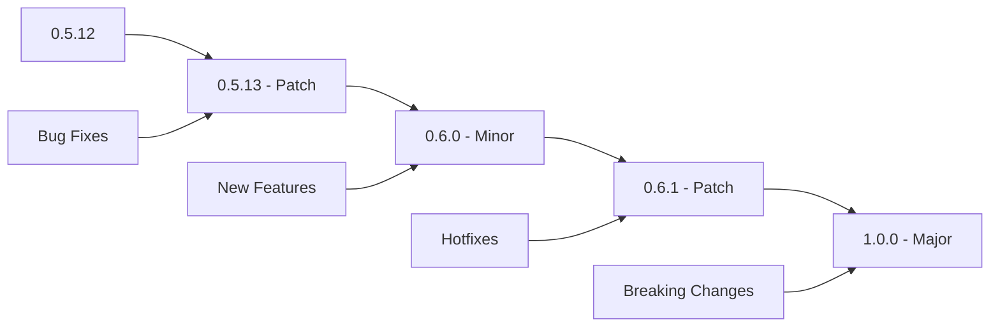

# 🚀 Release Management

Comprehensive guide for managing releases, versioning, and deployment automation for the AI Prompt Manager.

## Table of Contents

1. [Release Workflow](#release-workflow)
2. [Semantic Versioning](#semantic-versioning)
3. [Automated Publishing](#automated-publishing)
4. [Release Types](#release-types)
5. [Pipeline Configuration](#pipeline-configuration)
6. [Troubleshooting](#troubleshooting)

---

## Release Workflow

### Quick Release Process

```bash
# 1. Update version
poetry version patch|minor|major

# 2. Update CHANGELOG.md
# Add new version section with changes

# 3. Commit and push
git add .
git commit -m "chore: bump version to $(poetry version -s)"
git push origin main

# 4. Create release via GitHub UI or CLI
gh release create "v$(poetry version -s)" \
  --title "Release $(poetry version -s)" \
  --notes-file RELEASE_NOTES.md
```

### Detailed Release Steps

#### 1. Pre-Release Preparation

```bash
# Ensure you're on the main branch
git checkout main
git pull origin main

# Run full test suite
poetry run pytest
poetry run flake8 .
poetry run black --check .

# Verify package builds correctly
poetry build
```

#### 2. Version Management

```bash
# Update version (choose appropriate level)
poetry version patch      # Bug fixes: 0.5.12 → 0.5.13
poetry version minor      # New features: 0.5.12 → 0.6.0
poetry version major      # Breaking changes: 0.5.12 → 1.0.0

# Verify version update
poetry version
```

#### 3. Update Documentation

```bash
# Update CHANGELOG.md with new version
cat > CHANGELOG_ENTRY.md << EOF
## [$(poetry version -s)] - $(date +%Y-%m-%d)

### Added
- New feature descriptions

### Changed
- Modified functionality descriptions

### Fixed
- Bug fix descriptions

### Removed
- Deprecated feature removals
EOF

# Prepend to CHANGELOG.md
cat CHANGELOG_ENTRY.md CHANGELOG.md > temp && mv temp CHANGELOG.md
rm CHANGELOG_ENTRY.md
```

#### 4. Commit and Tag

```bash
# Commit version changes
git add pyproject.toml CHANGELOG.md
git commit -m "chore: bump version to $(poetry version -s)"

# Create and push tag
git tag "v$(poetry version -s)"
git push origin main --tags
```

#### 5. Create GitHub Release

```bash
# Using GitHub CLI
gh release create "v$(poetry version -s)" \
  --title "Release $(poetry version -s)" \
  --notes "$(poetry version -s) release with improvements and bug fixes"

# Or create via GitHub web interface
# https://github.com/makercorn/ai-prompt-manager/releases/new
```

## Semantic Versioning

### Version Format

Following [Semantic Versioning 2.0.0](https://semver.org/):

```
MAJOR.MINOR.PATCH
```

### Version Types

#### Patch Releases (0.5.12 → 0.5.13)

**When to use:**
- Bug fixes
- Documentation updates
- Performance improvements
- Security patches

**Examples:**
```bash
# Bug fix release
poetry version patch

# Examples of patch-worthy changes:
# - Fix authentication error in speech transcription
# - Correct dashboard theme compatibility issue
# - Update translation keys for UI elements
# - Performance optimization for database queries
```

#### Minor Releases (0.5.12 → 0.6.0)

**When to use:**
- New features
- Enhancements to existing functionality
- Deprecation warnings
- Non-breaking API additions

**Examples:**
```bash
# Feature release
poetry version minor

# Examples of minor-worthy changes:
# - Add new AI provider support
# - Implement rules management system
# - Enhanced dashboard with new quick actions
# - New API endpoints for prompt visibility
```

#### Major Releases (0.5.12 → 1.0.0)

**When to use:**
- Breaking changes
- Architectural overhauls
- API incompatibilities
- Major feature rewrites

**Examples:**
```bash
# Breaking change release
poetry version major

# Examples of major-worthy changes:
# - Database schema breaking changes
# - API endpoint structure changes
# - Authentication system overhaul
# - Migration to new framework
```

### Version Planning

#### Release Roadmap



## Automated Publishing

### GitHub Actions Workflow

The project uses automated publishing via GitHub Actions with trusted publishing to PyPI:

```yaml
# .github/workflows/release.yml
name: Release Pipeline

on:
  release:
    types: [published]

jobs:
  test:
    runs-on: ubuntu-latest
    steps:
      - uses: actions/checkout@v4
      - name: Set up Python
        uses: actions/setup-python@v4
        with:
          python-version: '3.12'
      - name: Install Poetry
        uses: snok/install-poetry@v1
      - name: Install dependencies
        run: poetry install --with dev,test
      - name: Run tests
        run: poetry run pytest
      - name: Run linting
        run: |
          poetry run black --check .
          poetry run flake8 .

  publish:
    needs: test
    runs-on: ubuntu-latest
    environment: release
    permissions:
      id-token: write
    steps:
      - uses: actions/checkout@v4
      - name: Set up Python
        uses: actions/setup-python@v4
        with:
          python-version: '3.12'
      - name: Install Poetry
        uses: snok/install-poetry@v1
      - name: Build package
        run: poetry build
      - name: Publish to PyPI
        uses: pypa/gh-action-pypi-publish@release/v1

  docker:
    needs: test
    runs-on: ubuntu-latest
    steps:
      - uses: actions/checkout@v4
      - name: Set up Docker Buildx
        uses: docker/setup-buildx-action@v3
      - name: Login to GitHub Container Registry
        uses: docker/login-action@v3
        with:
          registry: ghcr.io
          username: ${{ github.actor }}
          password: ${{ secrets.GITHUB_TOKEN }}
      - name: Build and push Docker image
        uses: docker/build-push-action@v5
        with:
          context: .
          push: true
          tags: |
            ghcr.io/${{ github.repository }}:latest
            ghcr.io/${{ github.repository }}:${{ github.ref_name }}
```

### Trusted Publishing Setup

#### PyPI Configuration

1. **Create PyPI Account**: Register at https://pypi.org
2. **Configure Trusted Publisher**:
   - Go to PyPI project settings
   - Add GitHub as trusted publisher
   - Repository: `makercorn/ai-prompt-manager`
   - Workflow: `release.yml`
   - Environment: `release`

#### GitHub Environment Setup

```bash
# Create release environment in GitHub
# Repository → Settings → Environments → New Environment
# Name: release
# Protection rules:
# - Required reviewers (optional)
# - Wait timer (optional)
# - Deployment branches: main only
```

### Manual Publishing (Fallback)

```bash
# Build package
poetry build

# Check package
poetry run twine check dist/*

# Upload to TestPyPI (testing)
poetry run twine upload --repository testpypi dist/*

# Upload to PyPI (production)
poetry run twine upload dist/*
```

## Release Types

### Draft Releases

**Purpose**: Internal testing and review before public release

**Workflow:**
```bash
# Create draft release
gh release create "v$(poetry version -s)" \
  --title "Release $(poetry version -s)" \
  --notes "Draft release for testing" \
  --draft

# Test draft release
# - Download and test artifacts
# - Verify documentation
# - Check Docker images

# Publish when ready
gh release edit "v$(poetry version -s)" --draft=false
```

### Pre-releases

**Purpose**: Beta testing with early adopters

**Workflow:**
```bash
# Create pre-release version
poetry version prerelease  # 0.5.12 → 0.5.13a1

# Create pre-release on GitHub
gh release create "v$(poetry version -s)" \
  --title "Pre-release $(poetry version -s)" \
  --notes "Beta version for testing" \
  --prerelease

# Promote to stable when ready
poetry version patch      # 0.5.13a1 → 0.5.13
```

### Hotfix Releases

**Purpose**: Critical bug fixes that can't wait for next planned release

**Workflow:**
```bash
# Create hotfix branch from main
git checkout -b hotfix/critical-fix main

# Make minimal fix
# ... implement fix ...

# Version bump (patch)
poetry version patch

# Test thoroughly
poetry run pytest

# Merge to main
git checkout main
git merge hotfix/critical-fix

# Release immediately
git tag "v$(poetry version -s)"
git push origin main --tags

# Create release
gh release create "v$(poetry version -s)" \
  --title "Hotfix $(poetry version -s)" \
  --notes "Critical bug fix for [issue description]"
```

### Stable Releases

**Purpose**: Production-ready releases for general use

**Criteria:**
- All tests passing
- Documentation updated
- No known critical bugs
- Performance regression testing complete
- Security review completed (for major releases)

**Workflow:**
```bash
# Final testing before stable release
poetry run pytest
poetry run pytest tests/e2e/ -v

# Create stable release
gh release create "v$(poetry version -s)" \
  --title "Stable Release $(poetry version -s)" \
  --notes "Production-ready release with new features and improvements"
```

## Pipeline Configuration

### Multi-Platform Publishing

#### Docker Images

```dockerfile
# Multi-platform Docker build
FROM python:3.12-slim as base

# Platform-specific optimizations
FROM base as amd64
# x86_64 specific setup

FROM base as arm64
# ARM64 specific setup

FROM ${TARGETARCH} as final
# Copy application code
COPY . /app
WORKDIR /app

# Install dependencies
RUN pip install poetry && \
    poetry install --only=main

# Start application
CMD ["poetry", "run", "python", "run.py"]
```

#### GitHub Actions Matrix Build

```yaml
strategy:
  matrix:
    os: [ubuntu-latest, windows-latest, macos-latest]
    python-version: ['3.12']
    architecture: [x64]

steps:
  - name: Build for ${{ matrix.os }}
    run: poetry build
```

### Release Validation

#### Automated Testing

```yaml
test-release:
  runs-on: ubuntu-latest
  steps:
    - name: Download release artifacts
      run: |
        gh release download "${{ github.ref_name }}" \
          --pattern "*.whl" \
          --pattern "*.tar.gz"
    
    - name: Test wheel installation
      run: |
        pip install *.whl
        python -c "import promptman; print('✅ Import successful')"
        python -m promptman --help
    
    - name: Test source distribution
      run: |
        pip install *.tar.gz
        python -c "import promptman; print('✅ Source install successful')"
```

#### Security Scanning

```yaml
security-scan:
  runs-on: ubuntu-latest
  steps:
    - uses: actions/checkout@v4
    - name: Run security scan
      run: |
        poetry run bandit -r . --format json -o bandit-report.json
        poetry run safety check --json --output safety-report.json
    
    - name: Upload security reports
      uses: actions/upload-artifact@v3
      with:
        name: security-reports
        path: "*-report.json"
```

### Release Notifications

#### Slack Integration

```yaml
notify-slack:
  runs-on: ubuntu-latest
  if: success()
  steps:
    - name: Slack Notification
      uses: 8398a7/action-slack@v3
      with:
        status: success
        channel: '#releases'
        text: |
          🚀 New release published: ${{ github.ref_name }}
          📦 Package: https://pypi.org/project/promptman/${{ github.ref_name }}
          🐳 Docker: ghcr.io/makercorn/ai-prompt-manager:${{ github.ref_name }}
      env:
        SLACK_WEBHOOK_URL: ${{ secrets.SLACK_WEBHOOK }}
```

#### Email Notifications

```yaml
notify-email:
  runs-on: ubuntu-latest
  steps:
    - name: Send email notification
      uses: dawidd6/action-send-mail@v3
      with:
        server_address: smtp.gmail.com
        server_port: 465
        username: ${{ secrets.EMAIL_USERNAME }}
        password: ${{ secrets.EMAIL_PASSWORD }}
        subject: "New AI Prompt Manager Release: ${{ github.ref_name }}"
        body: |
          A new version of AI Prompt Manager has been released!
          
          Version: ${{ github.ref_name }}
          Release Notes: ${{ github.event.release.html_url }}
          
          Install with: pip install promptman==${{ github.ref_name }}
        to: releases@example.com
```

## Troubleshooting

### Common Issues

#### Build Failures

```bash
# Debug build issues
poetry build --verbose

# Check package structure
tar -tzf dist/*.tar.gz | head -20

# Validate wheel
poetry run twine check dist/*
```

#### Publishing Failures

```bash
# Test PyPI upload (dry run)
poetry run twine upload --repository testpypi dist/* --verbose

# Check PyPI project status
curl -s https://pypi.org/pypi/promptman/json | jq .info.version

# Verify trusted publishing configuration
# GitHub → Repository → Settings → Secrets and variables → Actions
# PyPI → Project → Settings → Publishing
```

#### Docker Build Issues

```bash
# Build locally for debugging
docker build -t ai-prompt-manager:debug .

# Check multi-platform build
docker buildx build --platform linux/amd64,linux/arm64 -t test .

# Inspect image layers
docker history ai-prompt-manager:debug
```

#### Version Conflicts

```bash
# Reset version if needed
git tag -d "v$(poetry version -s)"
git push origin --delete "v$(poetry version -s)"

# Set correct version
poetry version 0.5.12  # Set specific version
```

### Debug Commands

```bash
# Check GitHub Actions status
gh run list --workflow=release.yml

# View workflow logs
gh run view --log

# Download release artifacts
gh release download v0.5.12

# Test package installation
pip install --index-url https://test.pypi.org/simple/ promptman==0.5.12
```

### Release Rollback

```bash
# Remove bad release
gh release delete v0.5.12 --yes

# Remove from PyPI (contact PyPI support if needed)
# PyPI doesn't allow deletion, only yanking
pip yank promptman==0.5.12

# Remove Docker images
docker rmi ghcr.io/makercorn/ai-prompt-manager:v0.5.12
```

### Best Practices

1. **Always test in staging** before production release
2. **Use semantic versioning** consistently
3. **Maintain detailed changelogs** for user communication
4. **Automate as much as possible** to reduce human error
5. **Have rollback procedures** ready for critical issues
6. **Monitor release metrics** and user feedback
7. **Coordinate with team** on breaking changes
8. **Document release procedures** and keep them updated

---

*This release management guide covers the complete lifecycle of releases for the AI Prompt Manager. Follow these procedures to ensure consistent, reliable releases.*