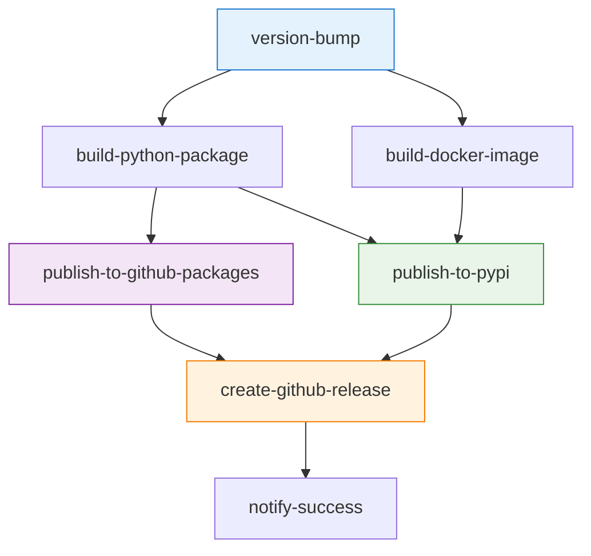

# Release Pipeline Improvements Summary

## 🚀 Overview

The release pipeline has been significantly enhanced to provide secure, multi-platform package publishing with modern best practices for software distribution and security.

## ✨ Key Improvements

### 1. **Multi-Platform Package Publishing**

#### GitHub Packages Integration
- **Purpose**: Enterprise package hosting for organizations
- **Benefits**: 
  - Private package repositories for organizations
  - Integration with GitHub authentication
  - Team-based access control
  - Audit logging and compliance
- **Usage**:
  ```bash
  pip install --index-url https://pypi.pkg.github.com/makercorn/simple/ promptman
  ```

#### PyPI Trusted Publishing
- **Purpose**: Secure, token-free publishing to PyPI
- **Benefits**:
  - ✅ **Zero Secrets**: No API tokens stored in GitHub
  - ✅ **Enhanced Security**: Uses OpenID Connect (OIDC) for authentication
  - ✅ **No Maintenance**: No token rotation or expiration concerns
  - ✅ **Audit Trail**: Better traceability of all publish operations
- **Implementation**: Uses `pypa/gh-action-pypi-publish@release/v1` with `id-token: write` permission

### 2. **Security Enhancements**

#### OIDC Authentication
```yaml
permissions:
  contents: read
  packages: write
  id-token: write  # Critical for trusted publishing
```

#### Environment Protection
- **Production Environment**: `pypi` environment with protection rules
- **Deployment Gates**: Optional approval requirements
- **Branch Restrictions**: Limit to main/release branches only

#### Package Verification
- **SHA256 Checksums**: Automatic generation for all packages
- **Twine Validation**: Package integrity verification before publishing
- **Sigstore Integration**: Docker image signing with cosign

### 3. **Enhanced Workflow Architecture**

#### Job Dependencies


#### Publishing Strategy
- **GitHub Packages**: Always publishes for all releases (including pre-releases)
- **PyPI**: Only publishes for stable releases (non-draft, non-prerelease)
- **Docker Images**: Multi-platform builds with signing

### 4. **Release Assets & Documentation**

#### Comprehensive Release Notes
- **Installation Options**: Docker, PyPI, GitHub Packages, and source
- **Multi-Platform Support**: Installation commands for all supported methods
- **Security Information**: Package verification and signing details
- **Direct Links**: Easy access to all distribution channels

#### Asset Management
- **Python Packages**: Wheel and source distributions attached to releases
- **Docker Images**: Multi-platform container images in GitHub Container Registry
- **Documentation**: Comprehensive guides and API documentation
- **Checksums**: SHA256 verification for all downloadable assets

## 🔧 Configuration Requirements

### PyPI Trusted Publishing Setup

1. **PyPI Project Configuration**:
   ```yaml
   Repository owner: MakerCorn
   Repository name: ai-prompt-manager  
   Workflow filename: release.yml
   Environment name: pypi
   ```

2. **GitHub Environment Setup**:
   - Create `pypi` environment in repository settings
   - Configure protection rules (optional but recommended)
   - No secrets required (uses OIDC)

3. **Workflow Configuration**:
   ```yaml
   environment:
     name: pypi
     url: https://pypi.org/p/${{ needs.build-python-package.outputs.package-name }}
   permissions:
     id-token: write  # Mandatory for trusted publishing
   ```

## 📊 Publishing Matrix

| Platform | Trigger | Authentication | Audience |
|----------|---------|----------------|----------|
| **GitHub Packages** | All releases | GitHub Token | Enterprise/Organizations |
| **PyPI** | Stable releases only | OIDC Trusted Publishing | Public/End Users |
| **Docker Registry** | All releases | GitHub Token | Container Users |
| **GitHub Releases** | All releases | GitHub Token | All Users |

## 🎯 Benefits Summary

### For Users
- **Multiple Installation Options**: Choose the best distribution method for your needs
- **Enhanced Security**: All packages are signed and verified
- **Enterprise Support**: Private package repositories for organizations
- **Consistent Experience**: Same package available across all platforms

### For Maintainers
- **Simplified Security**: No API tokens to manage or rotate
- **Automated Publishing**: Zero-touch publishing process
- **Comprehensive Monitoring**: Full visibility into publishing process
- **Flexible Distribution**: Support for different user needs and compliance requirements

### For Organizations
- **Private Packages**: Access to packages through GitHub Packages
- **Compliance**: Audit trails and access control integration
- **Security**: Enhanced security through OIDC and organizational controls
- **Integration**: Seamless integration with existing GitHub workflows

## 🚀 Next Steps

1. **Configure PyPI Trusted Publishing** (requires one-time setup)
2. **Test Release Process** with a pre-release to validate configuration
3. **Update Documentation** to reflect new installation options
4. **Monitor Publishing** for any issues or improvements

---

**Result**: A modern, secure, and comprehensive package publishing pipeline that supports multiple distribution channels while maintaining the highest security standards and providing flexibility for different user needs.